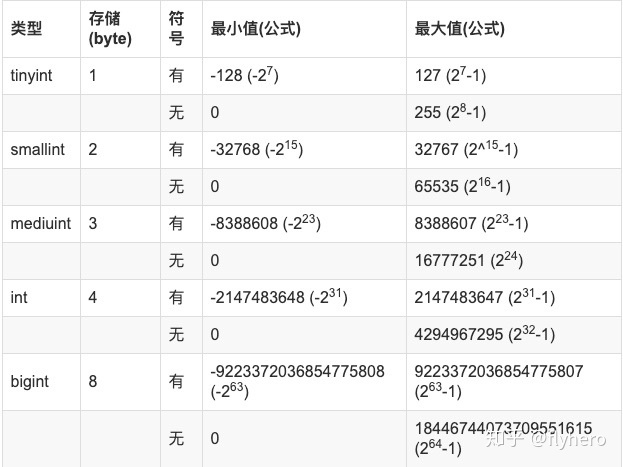
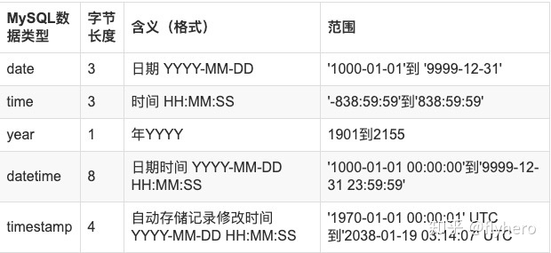

# MySQL
`高性能mysql`

- 参考题
`https://zhuanlan.zhihu.com/p/61273508`

~~~
    你们分布式事务怎么做的？

    那么，你可以按照这样的思路回答：

    1.在项目中某场景使用到了分布式事务
    2.为什么要用分布式事务？
    3.怎么使用的分布式事务？
    4.在使用过程中遇到了什么问题，然后怎么解决的？
    5.如果看过源码，讲讲分布式事务框架的源码和实现思想
~~~

#### **1. MySQL锁有几种**
`https://www.aneasystone.com/archives/2017/11/solving-dead-locks-two.html`
`上篇文章总结的很好, to be finished`
~~~
    表／行／页-锁：
        表级锁（table-level locking）：MyISAM和MEMORY存储引擎
        行级锁（row-level locking） ：InnoDB存储引擎
        页面锁（page-level-locking）：BDB存储引擎

        表级锁：开销小，并发低，加锁快；不会出现死锁；锁定粒度大，发生锁冲突的概率最高,并发度也最低。
        行级锁：开销大，并发高，加锁慢；会出现死锁；锁定粒度最小，发生锁冲突的概率最低,并发度也最高。
        页面锁：开销和加锁时间界于表锁和行锁之间；会出现死锁；锁定粒度界于表锁和行锁之间，并发度一般。

    共享／排他锁
        共享锁又称读锁，是读取操作创建的锁。其他用户可以并发读取数据，但任何事务都不能对数据进行修改（获取数据上的排他锁），直到已释放所有共享锁。
        排他锁又称写锁，如果事务T对数据A加上排他锁后，则其他事务不能再对A加任任何类型的封锁。获准排他锁的事务既能读数据，又能修改数据。

    Mysiam锁模式
        MyISAM在执行查询语句（SELECT）前，会自动给涉及的所有表加读锁，在执行更新操作（UPDATE、DELETE、INSERT等）前，会自动给涉及的表加写锁。
        a、对MyISAM表的读操作(加读锁),不会阻塞其他进程对同一表的读请求,但会阻塞对同一表的写请求.只有当读锁释放后才会执行其它进程的写操作。
        b、对MyISAM表的写操作(加写锁),会阻塞其他进程对同一表的读和写操作，只有当写锁释放后，才会执行其它进程的读写操作。

    innodb锁模式
        意向锁是InnoDB自动加的，不需要用户干预。
        对于insert、update、delete，InnoDB会自动给涉及的数据加排他锁（X）；对于一般的Select语句，InnoDB不会加任何锁，事务可以通过以下语句给显示加共享锁或排他锁。
        共享锁： SELECT ... LOCK IN SHARE MODE;
        排他锁： SELECT ... FOR UPDATE;
~~~

#### **2. varchar与char的区别是什么？大小限制？utf8字符集下varchar最多能存多少个字符**

1. 主要区别：

~~~
    (1).char是一种长度固定的类型, varchar 长度可变；
    (2).char列检索出来的值，尾部空格会被删除，varchar会被保留；
~~~

2. 存多少
    - 声明为char的列长度是固定的,char的长度可选范围在0-255之间.也就是char最大能存储`255个字符`.如果该列是utf8编码,则该列所占用的字节数=字符数*3.如果是gbk编码则该列所占用的字节数=字符数*2

    - 采用varchar类型存储数据需要1-2个字节(长度超过255时需要2个字节)来存储字符串的实际长度.如果该列的编码为gbk,每个字符最多占用2个字节,最大长度不能超过32766个字符.如果该列的编码为utf8,每个字符最多占3个字节,最大字符长度为21845（21844）.
    - VARCHAR是变长长度，长度范围为0-21845(utf8)或16383(utf8mb4)字符，存储时，如果字符没有达到定义的位数，也不会在后面补空格，当然还有一或两个字节来描述该字节长度

3. 基础知识
    - varchar(10), 代表的是字符，无论英文或中文 都可以存储10个字符。

#### **3. 如果查询很慢，你会想到的第⼀个⽅式是什么？**
- 先加explain查看, type列, Extra列
- sql语句有没有什么问题, 以下为sql语句可能存在的问题:
`高性能mysql P196`
1. 方式：

    (1). 是否向数据库请求了不需要的数据
    - 查询不需要的记录
    - 多表关联时返回全部的列
    - 总是取出全部的列
    - 重复查询相同的数据

    (2). MySQL是否在扫描额外的记录
    - 最简单的衡量查询开销的的三个指标：
        - 响应时间： 服务时间(查询真正所花时间）和排队时间（等待某些资源而没有真正执行查询的时间--可能是等IO操作完成，也可能是等待行锁）, 响应时间手很多方面的影响，比如存取引擎的锁，高并发资源竞争，硬件响应等, 用 快速上限估计法来估计查询的响应时间；
            - 快速上限估计法：了解这个查询需要哪些索引以及他的执行计划是什么，然后计算大概需要多少个顺序和随机IO，再用其乘以具体硬件条件下一次IO的消耗时间，最后累加, 就可以获得一个大概的参考值；
        - 扫描的行数和访问类型：
            - explain语句中的type列反应了访问类型，访问类型有很多种, 从全表扫描到索引扫描、范围扫描、唯一索引扫描、常数引用等；这些列出来的， 速度按从慢到快, 扫描的行数也是按从大到小；
            - explain的Extra，using where时, 一般MySQL能够使用如下三种方式应用where条件， 从好到坏依次是：
                - 在索引中使用where条件来过滤不匹配的记录， 这是在存储引擎层完成的；
                - 使用索引覆盖扫描（在Extra列中出现了Using index）来返回记录。直接从索引中过滤不需要的记录并返回命中的结果，这是在MySQL服务器层中完成的， 但无需再回表查询记录
                - 从数据表中返回数据，然后过滤不满足条件的记录（在Extra列中出现Using Where）， 这是在MySQL服务器层完成， MySQL需要先从数据表读出记录然后过滤；

        - 扫描的行数和返回的行数：理想的是两者==

#### **4.索引有什么用，大致原理是什么？索引的优点，代价（缺点）？**
`1.索引有什么用`

- 加速查询, 特别是如果还涉及到分组和排序的话;

`2. 索引的原理`

- 一种高效的数据结构， 通常使用BTree实现， 还有哈希索引，全文索引等其他索引

`3.索引的优点`

- 大大减少服务器需要扫描的数据量
- 索引可以帮助服务器避免排序和临时表
- 索引可以将随机IO变成顺序IO(1，顺序IO不需要多次磁盘寻道，2不需额外的排序操作)

`4。索引的代价`

- 加快检索， 但是降低了索引列的插入， 删除和更新值的速度， 对于写操作较多的表来说， 在索引更新方面的开销会非常大；

- 索引占据更大的空间；
    a. MYISAM 表，对于大量的索引， 有可能导致索引文件比数据文件更快的到达其limit；
    b. Innodb系统表空间里的所有InnoDB表， 都共享同一个存储空间池（数据和索引集中存储在同一个文件）， 添加索引会使表空间里用于存储的空间减少的更快， 加速到达文件的limit；

`总结`

- 编写查询语句时，应该尽可能选择合适的索引以避免单行查找、尽可能使用原生顺序从而避免额外的排序操作， 并尽可能的使用索引覆盖查询

#### **5. 外键有什么用，是否该用外键？外键一定需要索引吗？**
`技术内幕2.13`
`数据库中为什么不推荐使用外键约束` - `https://www.cnblogs.com/rjzheng/p/9907304.html`
>1. 有什么用
~~~
    1. 利用外键关系，可以在一个表里声明‘与另一个表里的某个列相关联的‘列

    2. A foreign key is a constraint, a relationship between two tables - that has nothing to do with an index 
~~~

>2. 是否该用外键
~~~
    1.性能问题
        数据库需要维护外键的内部管理；
        外键等于把数据的一致性事务实现，全部交给数据库服务器完成；
        有了外键，当做一些涉及外键字段的增，删，更新操作之后，需要触发相关操作去检查，而不得不消耗资源；
    2.并发问题
        在使用外键的情况下，每次修改数据都需要去另外一个表检查数据,需要获取额外的锁, 若是在高并发大流量事务场景，使用外键更容易造成死锁。
    3.拓展性问题(主要是分为两点)
        a.做平台迁移方便，比如你从Mysql迁移到Oracle，像触发器、外键这种东西，都可以利用框架本身的特性来实现，而不用依赖于数据库本身的特性，做迁移更加方便。
        b.分库分表方便，在水平拆分和分库的情况下，外键是无法生效的。将数据间关系的维护，放入应用程序中，为将来的分库分表省去很多的麻烦。

    4.包括在阿里的JAVA规范中也有下面这一条【强制】不得使用外键与级联，一切外键概念必须在应用层解决。
~~~

`3. 外键要索引吗？`

- 虽然不会自动创建， 还是建议安装上索引， 便于查找

#### **6. 了解Join吗，有几种**

`技术内幕P97`

- 内连接和外连接

~~~
    - 内连接只会显示在两个表里都匹配上的行；
    - 外连接还可以把其中一个表在另一个表里没有匹配的行也显示出来， 以NULL显示；
~~~

#### **7. 索引有几类， BTree与Hash索引的区别**

`高性能MySQL5.1.1`

- B-Tree，Hash， 空间索引（R-Tree），全文索引，其他索引

#### **8. innodb的两阶段锁定协议是什么情况？**
`DDIA 第七章事务两阶段锁定`
`https://en.wikipedia.org/wiki/Two-phase_locking`

- 在数据库系统领域，并发控制机制主要有两种，即锁和多版本机制。

- 两阶段锁
~~~
    1. 是一种所谓的悲观并发控制机制(pessimistic):它是基于这样的原则:如果有事情可能出错(如另一个事务所持有的锁所表示的),最好等到情况安全后再做任何事情。这就像互斥,用于保护多线程编程中的数据结构;

    2. 只要没有写入, 就允许多个事务同时读取同一个对象, 但对象只要有写入, 就需要独占访问的权限:
        a. 如果事务A读取了一个对象, 如果事务B想要写入该对象, 那么B必须要等到A提交或者是中止时才能继续;
        b. 如果事务A写入一个对象, 并且事务B想要对取, 则B必须等到A提交或者是中止才能继续;
~~~

#### **9. SQL中Where与Having的区别**
- “Where” 是一个约束声明，使用Where来约束来之数据库的数据，Where是在结果返回之前起作用的，且Where中不能使用聚合函数。

- “Having”是一个过滤声明，是在查询返回结果集以后对查询结果进行的过滤操作，在Having中可以使用聚合函数。
~~~
　　SQL实例：

　　一、显示每个地区的总人口数和总面积：

        SELECT region, SUM(population), SUM(area)
        FROM bbc
        GROUP BY region

　　     先以region把返回记录分成多个组，这就是GROUP BY的字面含义。分完组后，然后用聚合函数对每组中的不同字段（一或多条记录）作运算。

　　二、显示每个地区的总人口数和总面积．仅显示那些人口数量超过1000000的地区。

        SELECT region, SUM(population), SUM(area)
        FROM bbc
        GROUP BY region
        HAVING SUM(population)>1000000

        [注]在这里，我们不能用where来筛选超过1000000的地区，因为表中不存在这样一条记录。相反，HAVING子句可以让我们筛选成组后的各组数据

    ps:如果想根据sum后的字段进行排序可以在后面加上：order by sum(population) desc/asc    
~~~

#### **10. 数据库的隔离级别，一定会产生幻读吗？怎么解决**

`DDIA 第七章事务, 全章总结 -- 记住每个阶段对应的例子即可`
- 事务: 事务是应用程序将多个读写操作组合成一个逻辑单元的一种方式;

- 四种隔离级别(参考第49题)

#### **11. mysql in，not in,like, or走不走索引**
`高性能MySQL P173`
- like看情况, 如果不是通配符开头, 最左前缀原则, 是可以的, 通配符开头则不允许;
- 查询语句中使用or关键字时，只有or前后两个条件的列都是索引时，查询时才使用索引;
- 避免使用!=或＜＞、IS NULL或IS NOT NULL、IN ，NOT IN等这样的操作符,因为这会使系统无法使用索引,而只能直接搜索表中的数据;
-  能够用BETWEEN的就不要用IN,因为IN会使系统无法使用索引,而只能直接搜索表中的数据;

#### **12. **

#### **13. select时怎么加排它锁**

- for update
- 其他没有获取排它锁的线程, 如果要访问排它锁正在访问的对象, 会阻塞;

#### **14. 复合索引的结构**

`https://www.zhihu.com/question/36996520`

- mysql创建复合索引的规则是首先会对复合索引的最左边的，也就是第一个name字段的数据进行排序，在第一个字段的排序基础上，然后再对后面第二个的cid字段进行排序。其实就相当于 `实现了类似order by name cid`这样一种排序规则， 所以：第一个name字段是绝对有序的，而第二字段就是无序的了。

- 那么什么时候才能用到呢?当然是cid字段的索引数据也是有序的情况下才能使用咯，什么时候才是有序的呢？观察可知，当然是在name字段是等值匹配的情况下，cid才是有序的。发现没有，观察两个name名字为 c 的cid字段是不是有序的呢。从上往下分别是4  5。这也就是mysql索引规则中要求复合索引要想使用第二个索引，必须先使用第一个索引的原因。

#### **15. 如果建了⼀个包含多个列的索引，查询的时候只⽤了第⼀列，能不能⽤上这个索引？查三列呢？MySQL为什么使用B+树作为索引？如果where条件后⾯带有⼀个 i + 5 < 100 会使⽤到这个索引吗？**
`高性能mysql5.3.1`
- 不能, 参考
- 很简单

#### **16. 怎么看是否⽤到了某个索引？**
- explain语句, 参见33题

#### **17. like %aaa%会使⽤索引吗? like aaa%呢? **

`技术内幕P208`

- %aaa%不会， aaa%会会

#### **18. drop、truncate、delete的区别？**
-
-
-

#### **19. 你们数据库是否⽀持emoji表情，如果不⽀持，如何操作?**
- 数据库里面使用的是utf8编码，普通的字符串或者表情都是占位3个字节，所以utf8足够用了，但是移动端的表情符号占位是4个字节，普通的utf8就不够用了，为了应对无线互联网的机遇和挑战、避免 emoji 表情符号带来的问题、涉及无线相关的 MySQL 数据库建议都提前采用utf8mb4 字符集;

- UTF- 8：Unicode Transformation Format-8bit，允许含BOM，但通常不含BOM。是用以解决国际上字符的一种多字节编码，它对英文使用8位（即一个字节），中文使用24为（三个字节）来编码。UTF-8包含全世界所有国家需要用到的字符，是国际编码，通用性强;

- UTF8MB4：MySQL在5.5.3之后增加了utf8mb4的编码，mb4就是most bytes 4的意思，专门用来兼容四字节的unicode

#### ****

#### **21.**

#### **22. primary key 和 unique key 的区别**

`技术内幕P86`

- 每个表只包含一个primary key， 可以有多个unique key；

- pk 不能包含NULL值，unique行，（NULL值不与任何值相等，甚至是另一个NULL值）

#### **23. 为何，以及如何分区、分表；**
`结合DDIA一起看`
`http://blog.51yip.com/mysql/1029.html` -- mysql分表，分区的区别和联系

`http://blog.51yip.com/mysql/949.html`
>1 为何分表
~~~
    1. 当一张表的数据很大时， 查询耗时，分表的目的就在于减小数据库负担，缩短查询时间；
    2. mysql执行机制有行锁（Innodb），表锁（MyIsam），数据大之后的表锁不切实际；
~~~
>2.如何分表
~~~
    1.根据实际业务情况分，预先估计会出现大数据量并且访问频繁的表，将其分为若干个表：
        这种预估大差不差的，论坛里面发表帖子的表，时间长了这张表肯定很大，几十万，几百万都有可能。 聊天室里面信息表，几十个人在一起一聊一个晚上，时间长了，这张表的数据肯定很大。像这样的情况很多。所以这种能预估出来的大数据量表，我们就事先分出个N个表，这个N是多少，根据实际情况而定。以聊天信息表为例：

        我事先建100个这样的表，message_00,message_01,message_02..........message_98,message_99.然后根据用户的ID来判断这个用户的聊天信息放到哪张表里面，你可以用hash的方式来获得，可以用求余的方式来获得，方法很多，各人想各人的吧；

    2.利用merge存储引擎来实现分表
~~~

#### **24. NoSQL了解么，和关系数据库的区别**
`技术内幕2.6.2.5`
`InnoDB引擎4.9`
~~~
    非关系型数据库的优势：
    1. 性能NOSQL是基于键值对的，而且不需要经过SQL层的解析，所以性能非常高。
    2. 可扩展性同样也是因为基于键值对，数据之间没有耦合性，所以非常容易水平扩展。

    关系型数据库的优势：
    1. 复杂查询可以用SQL语句方便的在一个表以及多个表之间做非常复杂的数据查询。
    2. 事务支持使得对于安全性能很高的数据访问要求得以实现。
~~~

#### **25. 存储过程的优点**
`了解即可`
（1）.存储过程只在创造时进行编译，以后每次执行存储过程都不需再重新编译，而一般 SQL 语句每执行一次就编译一次,所以使用存储过程可提高数据库执行速度。 

（2）.当对数据库进行复杂操作时(如对多个表进行 Update,Insert,Query,Delete 时），可将此复杂操作用存储过程封装起来与数据库提供的事务处理结合一起使用。这些操作，如果用程序来完成，就变成了一条条的 SQL 语句，可能要多次连接数据库。而换成存储，只需要连接一次数据库就可以了。 

（3）.存储过程可以重复使用,可减少数据库开发人员的工作量。 

（4）.安全性高,可设定只有某此用户才具有对指定存储过程的使用权。

#### **26. 如何实现数据库的原子性，可以用伪代码实现吗**
`加排他锁`
- 定义: 所谓原子操作是指不会被线程调度机制打断的操作;这种操作一旦开始,就一直运行到结束,中间不会有任何 context switch 线程切换

#### **27. 如果有很多数据插⼊MYSQL 你会选择什么⽅式?（一个数据库，每十分钟会接收到百万级的数据进行插入，应该怎么设计？）**

#### **28. 在极端情况下，系统缓存全部失效，该如何防止流量全部打到数据库上**
`缓存重建问题`
`相关问题--redis开发与运维都有涉及`
-面对cache aside可能出现的全部打在数据库的情况， 比较简单的方式就是预热，可以用脚本来提前写入到 cache 热缓存。或者改用缓存策略， 使用Write-Through 直接写缓存，然后更新到数据库。

- 这个问题可以用一些可以提供持久化功能的缓存来实现，比如Redis，在未开启aof的情况下，其定期dump出来的rdb文件出能自动恢复出绝大部分数据；

- 而MongoDB与上面的方式不太一样，MongoDB采用mmap来将数据文件映射到内存中，所以当MongoDB重启时，这些映射的内存并不会清掉，因为它们是由操作系统维护的（所以当操作系统重启时，MongoDB才会有相同问题）。相对于其它一些自己维护Cache的数据库，MongoDB在重启后并不需要进行缓存重建与预热；

- 另外，新浪微博的timyang也曾经提出过一种缓存重建加锁的方式，也能部分解决此问题。简单来说就是缓存重建时，当多个客户端对同一个缓存数据发起请求时，会在客户端采用加锁等待的方式，对同一个Cache的重建需要获取到相应的锁才行，只有一个客户端能拿到锁，并且只有拿到锁的客户端才能访问数据库重建缓存，其它的客户端都需要等待这个拿到锁的客户端重建好缓存后直接读缓存，其结果是对同一个缓存数据，只进行一次数据库重建访问。但是如果访问分散比较严重，还是会瞬间对数据库造成非常大的压力。

#### **29. 数据库三范式**

`https://www.zhihu.com/question/24696366`

#### **30. 聚簇索引**
- 定义:
~~~
    1. 主键索引, 既存储索引值, 又在叶子中存储行的数据;
    2. 没有主键, 会选择unique key 做主键;
    3. 如果没有unique key, 则会在内部生成一个rowid做主键;

    二级索引的叶子节点保存的不是指向行的物理位置的指针,而是行的主键值;
~~~

- 优势:
~~~
    1. 根据主键找, 效率高;
    2. 
~~~

- 劣势:
~~~
    0.最大限度的提高了IO密集型应用的性能, 但如果数据在内存中, 访问的顺序就不重要了,
    1.如果碰到主键不规则的数据插入, 容易造成频繁的页分裂(随之相伴的是大量的数据碎片);
    2.二级索引的访问需要两次索引的查找;
~~~

- 启发:
~~~
    使用InnoDB时,应该尽可能地按主键顺序插入数据;
~~~

#### **31. 对于最左前缀不易区分的列, 比如url的存储与查找， 如何处置?**
- 把内容倒过来插入, 然后建立索引 -- `高性能Mysql P157页也有涉及`
- 伪哈希索引 (crc(32))--`高性能Mysql P148的实例非常值的一看`

#### **32. 说说对SQL语句优化有哪些方法？**
`高性能mysql`
`TO BE FINISHED`
~~~ 
    1. sql语句的时间花在哪?
        - 等待时间, 执行时间,
    2. 执行时间, 花在哪?
        - 查找
        - 取出
    3. 如何查的快
        - 查的快, 尽量走索引
        - 取的快, 索引覆盖
        - 传输少, 更少的行和列
~~~

#### **33. explain语句**
`高性能mysql 附录A`
- 字段解释:
~~~
    1. id: 查询的序号; 
    2. select_type:
        a. SIMPLE 简单查询(不包含子查询);
        b. PRIIMARY 含子查询或者派生查询;
            (1) subquery: 非From 子查询;
            (2) derived: from子查询;
            (3) union
            (4) union result: 
    3. table:
        a. 实际的表名;
        b. 表的别名;
        c. derived: from 子查询时;
        d. null: 直接计算结果, 不走表;

    4. type: 查询的方式;
        a. all:全表扫描;
        b. index: All扫描所有的数据行, 而index扫描所有的索引节点;
        c. range: 能根据索引做范围扫描;
        d. ref: 通过索引可以直接引用到某些数据行;
        e. const, system, null: 最优， 优化到常量级别；

    5. possible keys: 可能用到的键;
        a. 可能用到的索引, 最终只会用一个;

    6. key: 真正用到的索引;

    7. key_len: 最终用到的索引的长度;

    8. ref: 两表联查, 是否有引用关系;

    9. rows: 估计本次将要查询的行数;

    10. Extra: 额外的信息;
        a. index: 索引覆盖
        b. using where: 光靠索引定位不了， 还得where 来判断下；
        c. using temporary： 产生了临时表；
        d. using filesort： 文件排序(通常再内存， 如果取出的列是text类型， filesort将发生在磁盘上）；

~~~
#### **34. 缓存更新 策略**
`https://coolshell.cn/articles/17416.html`
`https://zhuanlan.zhihu.com/p/59167071`

- 错误实践: 先删缓存,然后再更新数据库;
~~~
    1. 两个并发操作, 如果一个读请求和一个更新请求, 写请求先删了缓存, 而读请求直接去数据库拿数据, 在数据库更新之前拿到就是原来的旧数据, 然后放入缓存, 此时写请求完成, 最后缓存中的数据是原来的数据(脏数据)
~~~

- 一. Cache Aside
~~~
    1. 最最常用的pattern, 逻辑如下:
        失效: 应用程序先从Cache取数据, 没有取到, 则从数据库取, 成功后, 放入缓存;
        命中: 应用程序直接从Cache获取数据, 返回;
        更新: 先把数据存到数据库中, 成功后, 再让缓存失效;

    注意，我们的更新是先更新数据库，成功后，让缓存失效。那么，这种方式是否可以没有文章前面提到过的那个问题呢？我们可以脑补一下。

    一个是查询操作，一个是更新操作的并发，首先，没有了删除cache数据的操作了，而是先更新了数据库中的数据，此时，缓存依然有效，所以，并发的查询操作拿的是没有更新的数据，但是，更新操作马上让缓存的失效了，后续的查询操作再把数据从数据库中拉出来。而不会像文章开头的那个逻辑产生的问题，后续的查询操作一直都在取老的数据。

    这是标准的design pattern，包括Facebook的论文《Scaling Memcache at Facebook》也使用了这个策略。为什么不是写完数据库后更新缓存？你可以看一下Quora上的这个问答《Why does Facebook use delete to remove the key-value pair in Memcached instead of updating the Memcached during write request to the backend?》，主要是怕两个并发的写操作导致脏数据。

    那么，是不是Cache Aside这个就不会有并发问题了？不是的，比如，一个是读操作，但是没有命中缓存，然后就到数据库中取数据，此时来了一个写操作，写完数据库后，让缓存失效，然后，之前的那个读操作再把老的数据放进去，所以，会造成脏数据。

    但，这个case理论上会出现，不过，实际上出现的概率可能非常低，因为这个条件需要发生在读缓存时缓存失效，而且并发着有一个写操作。而实际上数据库的写操作会比读操作慢得多，而且还要锁表，而读操作必需在写操作前进入数据库操作，而又要晚于写操作更新缓存，所有的这些条件都具备的概率基本并不大。

    所以，这也就是Quora上的那个答案里说的，要么通过2PC或是Paxos协议保证一致性，要么就是拼命的降低并发时脏数据的概率，而Facebook使用了这个降低概率的玩法，因为2PC太慢，而Paxos太复杂。当然，最好还是为缓存设置上过期时间。
~~~

- 二. Read/Write through -- 细节不完善
~~~
    1. 逻辑如下:
        命中: 直接获取数据;
        失效: 从数据库读取数据进缓存, 然后从缓存返回数据给调用者;
        更新:
            a. 如果没有命中缓存, 则直接更新数据库, 然后返回;
            b. 如果命中了缓存, 则更新缓存, 然后由Cache自己更新数据库(这是一个同步操作);

    The application uses the cache as the main data store, reading and writing data to it, while the cache is responsible for reading and writing to the database:
        Application adds/updates entry in cache
        Cache synchronously(同步) writes entry to data store
        Return

    Disadvantage(s): 
        write throughWhen a new node is created due to failure or scaling, the new node will not cache entries until the entry is updated in the database. Cache-aside in conjunction with write through can mitigate this issue

~~~

- 四. Write behind caching
~~~
    1. Write Behind 又叫 Write Back, 在更新数据的时候，只更新缓存，不更新数据库，而我们的缓存会异步地批量更新数据库。
    2. 一些了解Linux操作系统内核的同学对write back应该非常熟悉，这不就是Linux文件系统的Page Cache的算法吗?
    
    流程: In write-behind, the application does the following:
    Add/update entry in cache
    Asynchronously write entry to the data store, improving write performance

    Disadvantage(s): write-behind
        There could be data loss if the cache goes down prior to its contents hitting the data store.
        It is more complex to implement write-behind than it is to implement cache-aside or write-through.

~~~

#### **35. btree 索引**
`高性能Mysql5.1.1`
- BTree索引简介:
~~~
    1. BTree 索引意味着所有的值是按顺序存储的（很适合范围查找）， 并且每个叶子节点到根节点的距离相同；

    2. BTree 适用于全键值，键值范围, 键的最前缀查找, 精确匹配某一列并范围匹配另一列；
~~~

- BTree索引限制：
~~~
    1. 如果不是按照索引的最左列开始查找，则无法使用索引；

    2. 不能跳过中间的索引；

    3. 如果中间有某个列的范围查询，则右边所有的列都无法使用索引； 
~~~

#### **36. 哈希 索引**
`高性能Mysql5.1.1`
- 哈希索引简介:
~~~
    1. 基于哈希表实现,查询数据很快，只有精确匹配索引所有列的查询，才有效；

    2. 对每一行数据， 存储引擎都会对被索引的列计算一个哈希码， 哈希索引将所有的哈希码存储在索引中，同时在哈希表中保存每个指向数据行的指针;

    3. 只有Memory索引支持哈希索引
~~~

- 哈希索引限制：
~~~
    1. 哈希索引只包含哈希值和行指针， 没有索引覆盖一说；

    2. 索引的数据并不是根据索引（数据）值顺序存储的， 所以无法用于排序；

    3. 不支持部分匹配列查找； 

    4. 哈希冲突多， 查询费事， 维护代价高；
~~~

#### **37. InnoDB的自适应哈希索引**
- InnoDB
~~~
高性能Mysql P148

    当InnoDB注意到某些索引值被使用的非常频繁时，他会在内存中基于B-Tree索引之上再创建一个哈希索引，这是引擎自动和内部的行为，用户无法控制和配置；
~~~

#### **38. 设计索引有什么注意点**
- 注意要点
~~~
    1. 为用于搜索，排序或分组的列创建索引，也就是说，最佳索引列是那些出现在where 子句，连接子句，或者是出现在order by或 GROUP BY子句中的列；

    2. 认真考虑数据列的基数，列的基数是指它所容纳的所有非重复值的个数，通常来说，列的基数越高（包含的唯一值多， 重复值少）索引的效果越好；

    3. 索引值短小，对于InnoDB更有好处，主键值会在每一个二级索引（把主键值和二级索引值存储在一起）中重复出现，因此，如果主键值越长，则会导致每一个二级索引越大；

    4. 索引字符串的前缀, 想要对字符串列进行索引, 应当尽量指定前缀长度；

    5. 利用最左前缀，当创建包含n个列的复合索引时，实际上会创建n个专供MySQL使用的索引，复合索引修当于多个索引， 因为索引中最左边的任意数据列集合都可以用于匹配(参考14题， 复合索引结构)

    6. 不要建立过多的索引：1.每增加一个索引, 需要额外的磁盘空间，2.更新操作,需相应的更新索引（P205）,3索引太多时，将无法使用最好的索引（增加查询优化的工作）

    7. 让参与比较的索引类型保持匹配 ：散列索引不适合做范围查找

    8. 尽可能使用索引覆盖查询；
~~~

#### **39. 高性能的索引策略**
`高性能MySQL 5.3`
>1. 独立的列： 索引列不能使表达式的一部分， 也不能是函数的参数；
>2. 前缀索引和索引选择性：
~~~
    a. 完整列的选择性： COUNT(DISTINCT city)/COUNT(*)， 不同值/总数
    b. 选择性要足够高，达到上述完整列的选择性即可（即前缀不能太长）；
    
    如何创建前缀索引：
    ALTER TABLE sakila.city_demo ADD KEY(city(7))
~~~
>3. 多列索引：
~~~
    a.此处主要讲了Mysql5.0之后引入了一种x新的策略--索引合并;
    b.索引合并有时候是一种优化的结果, 但实际上更多的时候说明了表上的索引建的很糟糕;
    c.如果再explain中看到有索引合并(extra列), 检查查询和表的结构;
~~~
>4. 选择合适的索引列顺序:
~~~
    a. 在一个多列B-Tree索引中, 索引列的顺序意味着索引首先按照最左列进行排序;
    b. 如何选择索引的顺序, 经验法则:
        (1). 当不需要考虑排序或者分组的时候: 将选择性最高的列放在索引的最前列(实际业务中, 需要根据查询频率做相应的调整)

~~~
>5. 聚簇索引
~~~
    - 参考题30
~~~
>6. 覆盖索引 
~~~
    - 参考题41
~~~
>7. 使用索引扫描来做排序
~~~
    - 参考题 46
~~~
>8. 压缩(前缀)索引
>9. 冗余和重复索引
>10. 未使用的索引
>11. 索引和锁

#### **40. Union的规则**
~~~
“Mysql技术内幕P107”
    1. 列名和数据类型：
        a. 列名以第一个select语句为准；
        b. 通常对应列数据类型应该相同，如果不同，MySQL会进行必要的类型转换；
    2. 重复行处理： 
        a. 默认情况下会自动去掉重复的行;
        b. 如果要保留重复的行, 改 union 为 union all;
    3. 如果要使用 order by 和 limit:
        a. union 需要使用order by, 需要将 select 语句括起来, order by的列字段, 以第一个select语句中的列字段为准;
        b. limit 照常使用就好;
~~~

#### **41. 索引覆盖**
- 定义:
~~~
    如果一个索引包含所需要查询的字段的值, 就称之为覆盖索引;

    覆盖索引必须要存储索引列的值,只有BTree索引支持;
~~~
- 优势
~~~
    1. 索引条目小, 缓存负载小, 数据量大, 可能大部分时间都花在数据拷贝上了;
    2. MyISAM在内存中只缓存索引, 数据则依赖操作系统来缓存, 因此访问数据需要一次系统调用;
    3. 对InnoDB尤其有效, 可减少对主键索引的二次查询;
~~~

#### **42 . 数据库优化的几个阶段**
`https://www.cnblogs.com/rjzheng/p/9619855.html`

#### **43. 为何，以及如何分区**
`http://blog.51yip.com/mysql/1013.html`
`DDIA -- 第六章`
- 对于非常大的数据集,或非常高的吞吐量,仅仅进行复制是不够的:我们需要将数据进行分区(partitions),也称为分片(sharding);

- 一、键值数据的分区:
~~~
    a. 分区目标是将数据和查询负载均匀分布在各个节点上;
    b. 如果分区是不公平的;避免热点(不均衡导致的高负载的分区)最简单的方法是将记录随机分配给节点;此策略的缺点:当你试图读取一个特定的值时,你无法知道它在哪个节点上,所以你必须并行地查询所有的节点。
~~~
>1. 根据键的范围分区
~~~
    a. 为了均匀分配数据,分区边界需要依据数据调整,分区边界可以由管理员手动选择,也可以由数据库自动选择;
    b. 在每个分区中,我们可以按照一定的顺序保存键; 好处是进行范围扫描非常简单, 缺点是某些特定的访问模式会导致热点;
~~~

>2. 根据键的散列分区
~~~
    a. 许多分布式数据存储使用散列函数来确定给定键的分区;一旦你有一个合适的键散列函数,你可以为每个分区分配一个散列范围;
    b. 出于分区的目的,散列函数不需要多么强壮的加密算法:例如,Cassandra和MongoDB使用MD5;
    c. 分区边界可以是均匀间隔的,也可以是伪随机选择的(在这种情况下,该技术有时也被称为一致性哈希);
    
    缺点:
        失去了键范围分区的一个很好的属性:高效执行范围查询的能力;在MongoDB中,如果您使用了基于散列的分区模式,则任何范围查询都必须发送到所有分区;

    策略(DDIA P179):
        组合索引方法
        Cassandra中的表可以使用由多个列组成的复合主键来声明。键中只有第一列会作为散列的依据,而其他列则被用作Casssandra的SSTables中排序数据的连接索引;
        场景: 社交媒体, 一个用户可能发布多更新;如果更新的主键选择为(user_id, update_timestamp),那就可以有效的检索特定用户某个时间间隔内按时间戳排序的所有更新;
~~~

>3. 负载倾斜与消除热点
~~~
    场景:某个人名人发布一条状态, 这个事件可能导致大量写入同一个键;
    策略:
        在主键的开始或者是结尾添加一个随机数(一个两位数的十进制随机数就可以将主键分散为100钟不同的主键,从而存储在不同的分区中);
    缺点:
        任何读取都必须要做额外的工作,因为他们必须从所有100个主键分布中读取数据并将其合并。此技术还需要额外的记录,需要一些方法来跟踪哪些键需要被分割。
~~~

>4. 分片和次级索引
- 如果涉及次级索引, 情况将更加复杂;
~~~

~~~

#### **44. InnoDB 和MyISAM的数据分布对比**
- MyISAM 按照数据插入的顺序存储在磁盘上, 主键索引和其他索引没有什么不同, 主键索引就是一个名为primary的唯一非空索引;

- InnoDB聚簇索引的每一个叶子节点都包含了主键值,事务ID, 用于事务和MVCC的回滚指针,以及剩余的列;

#### **45. 延迟关联**
`高性能mysql P173`

#### **46. 使用索引扫描做排序**
- 如果 explain 出来的type 列为 index, 说明mysql使用了索引扫描来做排序;
- 限制条件:
~~~
    1. 索引列的顺序和order by 子句的顺序完全一致;
    2. 如果需要关联多张表, 只有当ORDER BY子句引用的字段全部为第一个表时;
    3. 需要满足最左前缀的要求(有特例, P176);
~~~

#### **47. 查询性能优化**
- 一.  慢查询基础: 优化数据访问
>1. 是否向数据库请求了不需要的数据;
~~~
    a. 
        (1). 查询不需要的记录, select大量数据, 然后取少部分, 简单有效的办法, 查询后面加limit
        (2). 多表关联时返回全部的列;
        (3). 总是取出全部的列;
        (4). 查询重复相同的数据;
~~~

>2. mysql 是否扫描额外的记录
~~~
    一般mysql能够使用如下三种方式应用where条件, 从好到坏依次为:
    1. 在索引中使用where条件来过滤不匹配的记录,这是在存储引擎层完成的;
    2. 使用索引覆盖扫描(Extra Using index)来返回记录, 服务器层完成, 无需回表查询;
    3. 从数据表返回数据, 然后过滤,这是再服务器层完成的;
~~~

- 二. 重构查询的方式;
>1. 一个复杂查询还是多个简单查询;
>2. 切分查询--以删除为例, 一次大的删除更好的方式是分批次删;
>3. 分解关联查询;
~~~
    1. 缓存效率更高;
    2. 查询分解后, 执行单个查询可以减少锁的竞争;
    高性能P203
~~~

- 三. 查询执行的基础: 但我们向mysql发送一个请求时,mysql到底做了些什么?
~~~
    1.客户端发送一条查询给服务器;
    2.服务器先检查缓存, 如果命中了缓存, 则立刻返回结果;
    3.服务器进行SQL解析, 预处理, 再由优化器生成对应的执行计划;
    4.根据优化器生成的执行计划, 调用存储引擎的API来执行查询;
    5.将结果返回给客户端;
~~~
>1. mysql 客户端/服务器通信协议
~~~
    协议半双工：客户端与服务器之间的通信协议是半双工，要么服务器给客户端发信息， 要么客户端给服务器发，不能同时发生；
    缺点：
        一旦一端开始发送消息，另一端要接收完整个消息才能响应它；
    对于一个mysql连接(线程), 任何时刻都有一个状态, 最简单的就是 show full processlist, 状态列表: 高性能P207
~~~
>2. 查询缓存

>3. 查询优化处理 **--重点**
~~~
    1. 首先是sql的解析, 接着预处理器验证权限;
    2  优化器将语法树转化为执行计划;一条查询可能有很多种执行方式, 优化器的作用就是找到最好的那条;
    3. mysql使用基于成本的优化器;
    4. 有很多原因可能导致优化器选择错误的执行计划 -- 示例: 高性能mysql P209
    5. mysql能够处理的优化类型: --示例: 高性能mysql P211
        a.列表In()的比较:mysql中IN列表的数据会先进行排序, 然后通过二分查找的方式确定列表中的值是否满足, 这是一个O(log n)复杂度的操作, 等价的转换成OR查询的复杂度为O(n), In()列表中有大量值时, mysql的处理速度会更快;
    6.执行计划
        a. mysql生成一棵指令查询树, 存储引擎执行完成这棵树,并返回结果;
    7. 关联查询优化器:
        a. 通常优化器定义的关联顺序比人自己关联的要准确
    8. 排序优化(同城filesort)
        a. 数量小于"排序缓冲区", mysql使用内存进行"快速排序";
        b. 内存不够, 先将数据分块, 对每个块使用"快速排序",最后merge

~~~
>4. 查询执行引擎

>5. 返回结果给客户端

- 四. 查询优化器的局限性
>1. 关联子查询
>2. UNION 的限制
>3. 索引合并优化
>4. 等值传递
>5. 并行执行
>6. 哈希关联
>7. 松散索引扫描
>8. 最大值和最小值优化
>9. 在同一个表上查询和更新

- 五. 查询优化器的提示

- 六. 优化特定类型的查询 **--重点**
>1. 优化COUNT()查询;
>2. 优化关联查询;
>3. 优化子查询;
>4. 优化group by 和 distinct 查询;
>5. 优化LIMIT分页;
>6. 优化SQL_CALC_FOUND_ROWS;
>7. 优化UNION查询
>8. 静态查询分析
>9. 使用用户自定义变量

#### **48. 数据类型优化**
- 一. 选择优化的数据类型
~~~
    1. 几个简单的原则:
        a. 更小的通常更好;
        b. 简单就好;
        c. 尽量避免NULL
~~~
>1. 整形类型
~~~
    1. tinyint, smallint, mediumint,  int, bigint 分别对应:
             8,       16,        24,   32,     64   位存储空间;

    2. 可以指定宽度, 如INT(11); -- 一些mysql客户端的设置, 用来显示字符的个数;
~~~

>2. 实数类型 
~~~
    - to be finished
~~~

>3. 字符串类型 
~~~
    1. varchar:
        a. 需要额外1个(列长度255以内)或者2个字节记录字符串的长度;
    2. varchar适用场景:
        a. 字符串的最大长度比平均长度大很多;
        b. 列的更新很少;
        c. 字符集使用了utf-8等类似的复杂字符集;

    3. char:
        a. 定长;
        b. 末尾空格会被删掉;
    4. char适用场景:
        a. 短, 而且列值长度相近的字符串, 例如md5;
        b. 经常变更的;

    5. BLOB 和 TEXT:
        a. mysql 把每个BLOB和TEXT值当作一个独立的对象处理, 都是为存储很大的数据而设计的字符串数据类型;
        b. BLOB和TEXT之间仅有的不同是, BLOB存储的是二进制数据, 没有排序规则和字符集, 而TEXT有;
    
    6. 枚举：
        a．非常紧凑，通常会将列值压缩到一个或者两个字节中, 实际存储的是整数；
        b. 在.frm 文件中保存"数字 - 字符串"映射关系的"查找表", 同理排序也是按照整数来排的;
    7. 枚举缺点:
        a. 列值是固定的, 添加, 删除字符串必须使用ALTER TABLE;

~~~

>4. 日期和时间类型 
~~~
    1. datetime
        a.范围1001~9999, 精度为秒;
        b. 8字节存储;
        c. 标准格式: "1991-01-17 18:18:18"

    2. timestamp
        a. 1970.01.01以来的秒数, 范围1970~2038;
        b. 4字节存储;
        c. 显示的值依赖时区;

    3 建议:
        a. 尽量使用timestamp, 更节省空间;
        b. 存储比秒更小粒度的时间和日期: 使用bigint 存储微秒级别的时间戳或者是double 存储秒之后的小数部分;
~~~

>5. 位数据类型 
~~~
    - to be finished
~~~

>6. 选择标识符
~~~
    - to be finished
~~~

>7. 特殊类型数据
~~~
    - to be finished
~~~

- 二. MySQL schema设计中的陷阱
~~~
    1. 太多的列:
        Mysql 的存储引擎API工作时需要在"服务层"和"存储引擎层"之间通过行缓冲格式拷贝数据, 然后在服务器层将缓冲内容解码成各个列;
    2. 太多的关联
    3. 全能的枚举
    4. 变相的枚举
    5. 不必要的NULL
~~~

- 三. 范式和反范式
`参见题29`
>1. 范式的优缺点
>2. 反范式的优缺点
>3. 混用范式化和反范式化

- 四. 缓存表和汇总表
>1. 物化视图
>2. 计数器表

- 五. 加快ALTER TABLE操作的速度
>1. 只修改 .frm文件 
>2. 快速创建MyISAM 索引

#### **49. 四种隔离级别**
>1. read uncommitted（读未提交)
~~~
    1. 它可以防止脏写，但不防止脏读
    2. 事务中的修改, 即使没有提交, 对其他事务都是可见的, 称之为脏读;
    3. 实际中非常少用;
~~~
    
>2. read commited （提已交读）== 不可重复读 -- 参考第50题
~~~
    1. 满足隔离性的简单定义：一个事务开始时，只能看见已经提交的事务的所做的修改，也就是说，一个事务从开始到提交之前，所做的任何改变对其他的事务是不可见的， 也叫“不可重复读”， 因为两次执行同样的查询，可能得到不一样的结果；

    2. 又被称为: 
~~~
    
>3. repeatable read (可重复读) == 快照隔离 -- 参考第51题
~~~
    1. 每个事务都从数据库的一致快照(consistent snapshot)中读取——也就是说,事务可以看到事务开始时在数据库中提交的所有数据。即使这些数据随后被另一个事务更改,每个事务也只能看到该特定时间点的旧数据;

    2. 快照隔离对长时间运行的只读查询(如备份和分析)非常有用;
~~~

>4. serialization （可串行化）
    - 会在读取的每一行数据上都加锁； 最高级别，强制事务串行执行，避免了幻读的问题;

#### **50. 读已提交(不可重复读)**
~~~
    术语解释：
        脏写：如果两个事务同时尝试更新数据库中的相同对象，我们通常认为后面的写入会覆盖前面的写入。但是，如果先前的写入是尚未提交事务的一部分，又会发生什么情况，后面的写入会覆盖一个尚未提交的值？这被称作脏写
~~~

>1. 它提供了两个保证：

    （1）从数据库读时，只能看到已提交的数据（没有脏读）
        a.防脏读原因:
            - 可能只看到部分数据更新, 以邮件+未读邮件计数器为例;
            - 事务可能回滚;

    （2）从数据库写时，只会覆盖已写入的数据（没有脏写）
        a. 脏写可能存在的例子:
            - DDIA P206  

>2. 实现读已提交：

    （1）防止脏写，最常见的情况是：数据库通过使用“行锁”来防止脏写：当事务想要修改特定对象，它必须首先获得该对象的锁，然后必须持有该锁直到事务被提交或者中止，一次只有一个事务可以持有任何给定对象的锁；如果另一个事务要写入同一个对象，必须等到第一个事务提交或者是中止后，才能获得该锁并继续；

    （2）防止脏读，对于写入的每个对象，数据库都会记住旧的已提交值，和当前写入的新值，当事务在正在进行时，任何其他读取对象的事务都会拿到旧值；

>3. 读已提交时可能发生的问题:
~~~
    (1). 示例 DDIA P207
    解决方法:
        快照隔离(可重复读)
~~~

#### **51. 可重复读(快照隔离)**
>1. 实现快照隔离:
~~~
    (1). 与读已提交类似, 快照隔离使用写锁来防止脏写;
    (2). 关键原则: 读不阻塞写, 写不阻塞读;
    (3). 为实现快照隔离, 数据库保留着一个对象的几个不同的提交版本, 这种技术被称为多版本并发控制(MVCC); 
    (4). 支持快照隔离的存储引擎通常也使用MVCC实现读已提交, 读已提交实际上就是保存了同一个对象的两个版本;
    (5). 具体过程:
        a. 当一个事务开始时, 它被赋予一个唯一的, 永远增长的事务ID, 每当事务向数据库写入任何内容时, 它所写入的数据都会被标记上写入者的事务ID;
        b. 一致性快照的可见性规则;
        C. 索引和快照隔离;
        d. 可重复读与命名混淆;
~~~

>2. 丢失更新
- 解决方案
~~~
    1. 原子写： 原子操作通常通过在读取对象时，获取其上的排他锁来实现，这种技术有时也被称作游标稳定性；
    2. 显示锁定：
    3. 自动检测丢失的更新: 原子操作和锁是通过强制读取-修改-写入序列按顺序发生，来防止丢失更新的方法。另一种方法是允许它们并行执行，如果事务管理器检测到丢失更新，则中止事务并强制它们重试其读取-修改-写入序列。
    4. 比较并设置（CAS）：只有当前值从上次读取时一直没有改变，才允许更新发生，如果当前值与先前读取的值不匹配，则更新不起作用，且必须重试读取-修改-写入序列；
~~~

#### **52. 可序列化**
>1. 可序列化：
- 读已提交和快照隔离级别会阻止某些竞争条件，但不会阻止另一些, 例如, 写入偏差和幻读
    ~~~
        0. 丢失更新
            a. 对应单一对象, 比如计数器

        1. 写入偏差
            a. 对应多对象, 医生值班的例子

        2. 幻读 -- 导致写入偏差的罪魁祸首
            - 一个事务中的写入改变另一个事务的搜索查询的结果,被称为幻读
            a. 支付,体现, 余额
    ~~~
- 通常被认为是最强的隔离级别，它保证即使事务可以并行执行，最终的结果与连续挨个执行一样，也就是说数据库可以防止所有可能的竞争条件；

#### **53. mysql表的复制**
~~~
    1.表与数据的复制->>实现表结构和数据的同步

    create table desttable select * from srctable;

            (desttable:目标表，srctable：原表）

    2.表结构的复制->>只实现表结构的同步

    create table desttable select  * from srctable where 0>1;
    或者
    create table desttable LIKE srctable;

    3.全表记录的复制->>将一个表的全部记录插入另外一个表

    insert into desttable select * from srctable;

    4.部分字段的复制

    insert into desttable(字段一，字段二.......) select (字段一，字段二.......)  from srctable;
~~~

#### **54. mysql慢查询日志**

#### **55. MySQL为什么使用B+树作为索引**
`http://blog.codinglabs.org/articles/theory-of-mysql-index.html` -- 此文章非常值得一读
- B-树和B+树最重要的一个区别就是: B+树只有叶节点存放数据，其余节点用来索引，而B-树是每个索引节点都会有Data域, 这就决定了B+树更适合用来存储外部数据，也就是所谓的磁盘数据;
~~~
    1. 一般来说索引非常大，尤其是关系性数据库这种数据量大的索引能达到亿级别，所以为了减少内存的占用，索引也会被存储在磁盘上。那么Mysql如何衡量查询效率呢？磁盘IO次数，B-树（B类树）的特定就是每层节点数目非常多，层数很少，目的就是为了就少磁盘IO次数，当查询数据的时候，最好的情况就是很快找到目标索引，然后读取数据，使用B+树就能很好的完成这个目的，但是B-树的每个节点都有data域（指针），这无疑增大了节点大小，说白了增加了磁盘IO次数（磁盘IO一次读出的数据量大小是固定的，单个数据变大，每次读出的就少，IO次数增多，一次IO多耗时啊！），而B+树除了叶子节点其它节点并不存储数据，节点小，磁盘IO次数就少。这是优点之一。
    
    2. 另一个优点是什么，B+树所有的Data域在叶子节点，一般来说都会进行一个优化，就是将所有的叶子节点用指针串起来。这样遍历叶子节点就能获得全部数据，这样就能进行区间访问;
~~~

#### **56. 建立一个表，id,name,id自增长，且为主键在原来的表上增加一列，创建时间列，并获取当前系统时间找出创建时间在某个时间范围以内，并按照创建时间降序排列在原来的表上增加一百条数据，名字字段每条后边加个0，比如第一个是name,下边是name0,name00....**

#### **57. 一条SQL语句执行得很慢的原因有哪些？**
`高性能MySQL 第六章`
`https://zhuanlan.zhihu.com/p/62941196`
`to be finished`

#### **58. MySQL极限**

#### **59. MySQL慢查询开启，语句分析**
#### **60. 如何防止数据库单点问题**
#### **61. 数据库主从复制配置, 主从数据同步的原理, 主从架构的延时和数据丢失怎么解决**
#### **62. **
#### **63. 查询缓慢和解决方式（explain、慢查询日志、show profile等）**
#### **64. 数据库崩溃时事务的恢复机制（REDO日志和UNDO日志）**
#### **65. mysql 如何执行关联查询**
`高性能P214`
- 嵌套循环关联
#### **66. **
#### **67. 分布式全局唯一ID怎样来实现**
`to be finished -- 参考mongo ObjectId的实现`
`http://cenalulu.github.io/mysql/guid-generate/`
`https://zhuanlan.zhihu.com/p/59289093`

- GUID的基本需求
    - 毫秒级的快速响应
    - 可用性强
    - prefix有连续性方便DB顺序存储
    - 体积小，8字节为佳

- 业界成熟方案列举
    - UUID 16字节
    - Twitter的Snowflake 8字节
    - Flikr的数据库自增 4/8字节
    - Instagram的存储过程 8字节
    - 基于MySQL UUID的变种 16字节

- 各个方案优劣的对比
    - UUID：
    ~~~
        优：java自带，好用。
        劣：占用空间大
    ~~~
    - Snowflake： timestamp + work number + seq number
    ~~~
        优：可用性强，速度快
        劣：需要引入zookeeper 和独立的snowflake专用服务器
    ~~~
    - Flikr：基于int/bigint的自增
    ~~~
        优：开发成本低
        劣：如果需要高性能，需要专门一套MySQL集群只用于生成自增ID。可用性也不强
    ~~~
    - Instagram：41b ts + 13b shard id + 10b increment seq
    ~~~
        优： 开发成本低
        劣： 基于postgreSQL的存储过程，通用性差
    ~~~
    - UUID变种：timestamp + machine number + random (具体见：变种介绍
    ~~~
        优： 开发成本低
        劣： 基于MySQL的存储过程，性能较差
    ~~~

#### **68. 分布式session如何实现的**
#### **69. 数据库主从同步数据一致性如何解决？技术方案的优劣势比较**
`DDIA shard章有讲`
#### **70. 死锁是怎么产生的**
`死锁四个必要条件`
#### **71. 死锁问题的分析和解决**
`https://www.aneasystone.com/archives/2018/04/solving-dead-locks-four.html`
#### **72. 常见 SQL 语句的加锁分析**
`https://www.aneasystone.com/archives/2017/12/solving-dead-locks-three.html`

#### **73. Mysql中事务ACID实现原理**
`https://www.cnblogs.com/rjzheng/p/10841031.html`
- 事务就是一组原子性的sql查询，或者说是一个独立的单元；

- start transaction 开始一个事务，事务中的所有读写操作被视为单个操作来执行, 要么使用commit，要么使用Rollback撤销；
~~~
    - A 原子性：一个事务必须被视为一个不可分割的最小单位，要么全部执行，要么全部不执行；

    - C 一致性：数据库总是从一个一致性的状态转换到另一个一致性的状态（两个账户之间的balance不会失衡）；

    - I 隔离性：同时执行的事务是相互隔离的，一个事务在提交前，对其他事务是不可见的；

    - D 持久性：一旦事务提交，则其所做的修改会永久的保存在数据库中；
~~~

- 实现原理
    >原子性: 能够再错误时中止事务, 丢弃所有部分更新的内容, 恢复到事务开始之前状态的能力;
    ~~~
        实现靠的是Innodb的undo log。
        undo log名为回滚日志，是实现原子性的关键，当事务回滚时能够撤销所有已经成功执行的sql语句，他需要记录你要回滚的相应日志信息。
        例如
            (1)当你delete一条数据的时候，就需要记录这条数据的信息，回滚的时候，insert这条旧数据
            (2)当你update一条数据的时候，就需要记录之前的旧值，回滚的时候，根据旧值执行update操作
            (3)当年insert一条数据的时候，就需要这条记录的主键，回滚的时候，根据主键执行delete操作
        undo log记录了这些回滚需要的信息，当事务执行失败或调用了rollback，导致事务需要回滚，便可以利用undo log中的信息将数据回滚到修改之前的样子。
    ~~~

    > 一致性:

#### **74. Innodb中mysql如何快速删除2T的大表**
`https://www.cnblogs.com/rjzheng/p/9497109.html`

#### **75. int(5) 括号中的数字代表什么?**

- 数字5并不是代表存储的长度，int型的长度是4字节固定的，括号里的数字仅仅代表最小显示的宽度。

- 那我们设置它的意义何在呢？其实当我们长度超过5的时候它是没用的，和没有设置一样，当长度没有超过5时，并且设置了zerofill(填充零)，它会在不足的从左侧填充零，假如插入了数字 22 ，那么显示的是 00022 （navicat不显示，可在cmd中查看）。
- int 括号中的数字为什么默认11或10 ？
~~~
    int有符号数最小值:

    -2 1 4 7 4 8 3 6 4 8 总共11位

    2 1 4 7 4 8 3 6 4 7 总共10位

~~~

#### **76. 定点型**
- 使用方式：即DECIMAL(M,D)
~~~
    M 表示十进制数字总的个数
    D 表示小数点后面数字的位数

    M的默认取值为10，D默认取值为0。如果创建表时，某字段定义为decimal类型不带任何参数，等同于decimal(10,0)。带一个参数时，D取默认值。
    M的取值范围为1~65，取0时会被设为默认值，超出范围会报错。
    D的取值范围为0~30，而且必须<=M，超出范围会报错。

    所以，很显然，当M=65，D=0时，可以取得最大和最小值。

    举例
        例如: DECIMAL(5,2)
        范围: -999.99 到 999.99

        如果存储时，整数部分超出了范围（如上面的例子中，添加数值为1000.01），就会报错，不允许存这样的值。

        如果存储时，小数点部分若超出范围，就分以下情况：

        若四舍五入后，整数部分没有超出范围，则只警告，但能成功操作并四舍五入删除多余的小数位后保存。如999.994实际被保存为999.99。
        若四舍五入后，整数部分超出范围，则报错，并拒绝处理。如999.995和-999.995都会报错。
~~~

#### **77. 浮点数**
    浮点数是用来表示实数的一种方法，它用 M(尾数) * B( 基数)的E(指数）次方来表示实数，相对于定点数来说，在长度一定的情况下，具有表示数据范围大的特点,但同时也存在误差问题。如果希望保证值比较准确，推荐使用定点数数据类型。

~~~
    举例
    例如: float(7,4)
    范围: -999.9999 到 999.9999

    MySQL保存值时进行四舍五入，因此如果在FLOAT(7,4)列内插入999.00009，近似结果是999.0001。

    float和double中的M和D的取值默认都为0，即除了最大最小值，不限制位数。

    M、D范围:

    M取值范围为0~255。FLOAT只保证6位有效数字的准确性，所以FLOAT(M,D)中，M<=6时，数字通常是准确的。如果M和D都有明确定义，其超出范围后的处理同decimal。
    D取值范围为0~30，同时必须<=M。double只保证16位有效数字的准确性，所以DOUBLE(M,D)中，M<=16时，数字通常是准确的。如果M和D都有明确定义，其超出范围后的处理同decimal。
    FLOAT和DOUBLE中，若M的定义分别超出7和17，则多出的有效数字部分，取值是不定的，通常数值上会发生错误。因为浮点数是不准确的，所以我们要避免使用“=”来判断两个数是否相等。

~~~

#### **78. 时间类型**
- 日期类型的选择
    如果你的应用不牵涉到时区/国际业务，那么你最好选择datetime/timestamp，可读性高，统计方便。
    如果你的应用牵涉的时区或国际业务，你们建议你使用bigint/timestamp来存储时间戳，这样没有时区的困扰，但bigint可读性差。

- 如果你认为你的应用能够运行到2037年以后，那么别用timestamp。

#### **79. 如果缓存失效，瞬间大量请求可能会直接访问数据库(缓存雪崩)**
- 
~~~
    均匀分布 : 我们应该在设置失效时间时应该尽量均匀的分布,比如失效时间是当前时间加上一个时间段的随机值;
    熔断机制 : 类似于SpringCloud的熔断器,我们可以设定阈值或监控服务,如果达到熔断阈值(QPS,服务无法响应,服务超时)时,则直接返回,不再调用目标服务,并且还需要一个检测机制,如果目标服务已经可以正常使用,则重置阈值,恢复使用;
    隔离机制 : 类似于Docker一样,当一个服务器上某一个tomcat出了问题后不会影响到其它的tomcat,这里我们可以使用线程池来达到隔离的目的,当线程池执行拒绝策略后则直接返回,不再向线程池中增加任务;
    限流机制 : 其实限流就是熔断机制的一个版本,设置阈值(QPS),达到阈值之后直接返回;

    facebook 放过一篇论文《Scaling Memcache at Facebook》有讨论过这个问题：
        3.2.1 LeasesWe introduce a new mechanism we call leases to address two problems: stale sets and thundering herds.
        
    其中 "thundering herds" 正是楼主提到的数据库穿透问题，一个热的缓存如果失效，在第一个访问数据库的请求得到结果写入缓存之前，期间的大量请求打穿到数据库；
    然后 “stale set” 属于数据一致性问题，假如一个实例更新了数据想去刷新缓存，而另一个实例读 miss 尝试读取数据库，这时两次缓存写入顺序不能保证，可能会导致过期数据写入缓存。
    
    这两个问题都是 look-aside cache 所固有的，需要提供一个机制来协调缓存的写入，这篇论文给出的方案就是 lease 机制，限制同一时刻一个键只有拥有唯一 lease 的客户端才能有权写入缓存：
        1. 如果 get 某键读 miss，返回客户端一个 64 位的 lease；
        2. 然后该键在写入之前如果收到 get 请求，将返回一个 hot miss 报错，客户端依据它判断自己要稍后重试，而不向数据库读取数据；
        3. 如果该键收到 delete 请求，那么会使 lease 失效；持有失效 lease 的 set 请求仍将成功，但后来的 get 请求将得到 hot miss 报错，并携带一个新的 lease；这里的 hot miss 报错中带有最后的值，但认为它处于 stale 状态，留给客户端去判断是否采用它，在一致性要求不严格的场景中可以进一步减少数据库请求；

    这一来允许 memcache 服务端协调数据库的访问，从而解决这两个问题。不过 lease 方案并不完美，因为 1. 需要改 memcache；2. 仍泄露逻辑到客户端，要求客户端遵循 lease 和 hot miss 的约定。
    在 facebook 后面的论文《TAO: Facebook's Distributed Data Store for the Social Graph》中介绍TAO 系统尝试解决的问题之一提到：
    Distributed control logic: In a lookaside cache architecture
        the control logic is run on clients that don’t communicate
        with each other. This increases the number of
        failure modes, and makes it difficult to avoid thundering
        herds. Nishtala et al. provide an in-depth discussion of
        the problems and present leases, a general solution [21].
        For objects and associations the fixed API allows us to
        move the control logic into the cache itself, where the
        problem can be solved more efficiently.
    也就是说，我们并不一定非 look aside cache 不可，如果把缓存的修改入口封装起来，走 write though cache，就不需要分布式地去协调所有客户端，在一个地方排队就够了。
~~~

#### **80. 缓冲穿透**
- 发生场景 : 此时要查询的数据不存在,缓存无法命中所以需要查询完数据库,但是数据是不存在的,此时数据库肯定会返回空,也就无法将该数据写入到缓存中,那么每次对该数据的查询都会去查询一次数据库

~~~
    解决方案 : 
        布隆过滤 : 我们可以预先将数据库里面所有的key全部存到一个大的map里面,然后在过滤器中过滤掉那些不存在的key.但是需要考虑数据库的key是会更新的,此时需要考虑数据库 --> map的更新频率问题;BloomFilter 类似于一个hbase set 用来判断某个元素（key）是否存在于某个集合中;
        缓存空值 : 哪怕这条数据不存在但是我们任然将其存储到缓存中去,设置一个较短的过期时间即可,并且可以做日志记录,寻找问题原因;
~~~

#### **81. MySQL数据库中MyISAM和InnoDB的区别**
- MyISAM：
~~~
    1.不支持事务，但是每次查询都是原子的；

    2.支持表级锁，即每次操作是对整个表加锁；

    3.存储表的总行数；

        一个MYISAM表有三个文件：索引文件、表结构文件、数据文件；

        采用菲聚集索引，索引文件的数据域存储指向数据文件的指针。辅索引与主索引基本一致，但是辅索引不用保证唯一性。
~~~

- InnoDb：

~~~
    支持ACID的事务，支持事务的四种隔离级别；

    支持行级锁及外键约束：因此可以支持写并发；

    不存储总行数；

    一个InnoDb引擎存储在一个文件空间（共享表空间，表大小不受操作系统控制，一个表可能分布在多个文件里），也有可能为多个（设置为独立表空，表大小受操作系统文件大小限制，一般为2G），受操作系统文件大小的限制；

    主键索引采用聚集索引（索引的数据域存储数据文件本身），辅索引的数据域存储主键的值；因此从辅索引查找数据，需要先通过辅索引找到主键值，再访问辅索引；最好使用自增主键，防止插入数据时，为维持B+树结构，文件的大调整。

    总结 -- 五点区别:
        1>.InnoDB支持事务，而MyISAM不支持事务
        2>.InnoDB支持行级锁，而MyISAM支持表级锁
        3>.InnoDB支持MVCC, 而MyISAM不支持
        4>.InnoDB支持外键，而MyISAM不支持
        5>.InnoDB不支持全文索引，而MyISAM支持。
~~~

#### **82. mysql里记录货币用什么字段类型好**
~~~
NUMERIC和DECIMAL类型被Mysql实现为同样的类型，这在SQL92标准允许。他们被用于保存值，该值的准确精度是极其重要的值，例如与金钱有关的数据。当声明一个类是这些类型之一时，精度和规模的能被(并且通常是)指定。

例如：

salary DECIMAL(9,2)

在这个例子中，9(precision)代表将被用于存储值的总的小数位数，而2(scale)代表将被用于存储小数点后的位数。

因此，在这种情况下，能被存储在salary列中的值的范围是从-9999999.99到9999999.99。

~~~

#### **83. MySQL数据库作发布系统的存储，一天五万条以上的增量，预计运维三年,怎么优化？**
~~~
    a. 设计良好的数据库结构，允许部分数据冗余，尽量避免join查询，提高效率。
    b. 选择合适的表字段数据类型和存储引擎，适当的添加索引。
    c. mysql库主从读写分离。
    d. 找规律分表，减少单表中的数据量提高查询速度。
    e. 添加缓存机制，比如memcached，apc等。
    f. 书写高效率的SQL。比如 SELECT * FROM TABEL 改为 SELECT field_1, field_2, field_3 FROM TABLE.
~~~

#### **84. 设置了索引但是无法使用的场景**
`高性能MySQL`
`TO BE FINISHED`

#### **85. 对于千万级别的大表, 应该如何优化**
`TO BE FINISHED`
`https://www.zhihu.com/question/19719997/answer/81930332`

#### **86. 解释MySQL外连接、内连接与自连接的区别**
`TO BE FINISHED`
先说什么是交叉连接: 交叉连接又叫笛卡尔积，它是指不使用任何条件，直接将一个表的所有记录和另一个表中的所有记录一一匹配。

内连接 则是只有条件的交叉连接，根据某个条件筛选出符合条件的记录，不符合条件的记录不会出现在结果集中，即内连接只连接匹配的行。
外连接 其结果集中不仅包含符合连接条件的行，而且还会包括左表、右表或两个表中
的所有数据行，这三种情况依次称之为左外连接，右外连接，和全外连接。

左外连接，也称左连接，左表为主表，左表中的所有记录都会出现在结果集中，对于那些在右表中并没有匹配的记录，仍然要显示，右边对应的那些字段值以NULL来填充。右外连接，也称右连接，右表为主表，右表中的所有记录都会出现在结果集中。左连接和右连接可以互换，MySQL目前还不支持全外连接。

#### **87. SQL语言包括哪几部分？每部分都有哪些操作关键字？**
`TO BE FINISHED`
SQL语言包括数据定义(DDL)、数据操纵(DML),数据控制(DCL)和数据查询（DQL）四个部分。

数据定义：Create Table,Alter Table,Drop Table, Craete/Drop Index等

数据操纵：Select ,insert,update,delete,

数据控制：grant,revoke

数据查询：select

#### **88. 自增主键用完了该怎么办**
- 简单版
~~~
    我们以无符号整型为例，存储范围为0～4294967295，约43亿！我们先说一下，一旦自增id达到最大值，此时数据继续插入是会报一个主键冲突异常,那解决方法也是很简单的，将Int类型改为BigInt类型，BigInt的范围如下
~~~

- 高深版
~~~
    假设啊，你的表里的自增字段为有符号的Int类型的，也就是说，你的字段范围为-2147483648到2147483648。 一切又那么刚好，你的自增ID是从0开始的，也就是说，现在你的可以用的范围为0～2147483648。 我们明确一点，表中真实的数据ID，肯定会出现一些意外，ID不一定是连续的。

    因此，表中的真实id必然会出现断续的情况。 好，那这会你的自增主键id的数据范围为0～2147483648，也就是单表21亿条数据！考虑id会出现断续，真实数据顶多18亿条吧。 老哥，都单表18亿条了，还不分库分表？你一旦分库分表了，就不能依赖于每个表的自增ID来全局唯一标识这些数据了。此时，我们就需要提供一 个全局唯一的ID号生成策略来支持分库分表的环境。

    面试官:"那自增主键达到最大值了，用完了怎么办？" 
    你:"这问题没遇到过，因为自增主键一般用int类型，一般达不到最大值，我们就分库分表了，所以不曾遇见过！"
~~~

#### **89. 分库分表后如何部署上线**

#### **90. innodb的优势**

#### **91. MySQL 三种关联查询的方式: ON vs USING vs 传统风格**
~~~
    看看下面三个关联查询的 SQL 语句有何区别？

        SELECT * FROM film JOIN film_actor ON (film.film_id = film_actor.film_id)
        SELECT * FROM film JOIN film_actor USING (film_id)
        SELECT * FROM film, film_actor WHERE film.film_id = film_actor.film_id
        
    最大的不同更多是语法糖，但有一些有意思的东西值得关注。

    为了方便区别，我们将前两种写法称作是 ANSI 风格，第三种称为 Theta 风格。

    1.Theta 风格
        在 FROM 短语中列出了关联的表名，而 WHERE 短语则指定如何关联。

        这种写法被认为是古老的方式，有些时候比较难以理解，请看下面查询：

        SELECT * FROM film, film_actor WHERE film.film_id = film_actor.film_id AND actor_id = 17 AND film.length > 120
        上述查询列出片长超过 120 分钟的电影，其中包括演员编号是 17 的条件。别在意查询结果，查询本身如何呢？WHERE 表达式中包含三个条件，要看出哪个条件是关联，哪个条件是过滤还是稍费点事的。不过还是相对简单的，但如果是 5 个表，20 多个条件呢？

    2. ANSI 风格: ON
        使用 JOIN ... ON 可以将表关联的条件和记录过滤条件分开，将上面的语句重写后的结果如下：

        SELECT * FROM film JOIN film_actor ON (film.film_id = film_actor.film_id) WHERE actor_id = 17 AND film.length > 120
        看起来清晰许多。

    
    3.ANSI 风格: USING
        有一种特殊情况，当两个要关联表的字段名是一样的，我们可以使用  USING ，可减少 SQL 语句的长度:

        SELECT * FROM film JOIN film_actor USING (film_id) WHERE actor_id = 17 AND film.length > 120
        这个时候括号就是必须的了。这种写法很好，输入更少的单词，查询的性能也非常棒，但还需要注意一些差异。

    就是说这三种方式除了写法不同外，没什么区别
~~~

#### **92. 一致性哈希**
`程序员代码面试指南`--P313

#### **93. 事务的二段提交**
`DDIA`--第九章?
#### **94. 讲讲es**
`https://zhuanlan.zhihu.com/p/62892586`
#### **95.用个通俗的例子讲一讲死锁**
`https://zhuanlan.zhihu.com/p/26945588`
#### **96. mysql中limit offset**
~~~
    ① selete * from testtable limit 2,1;

    ② selete * from testtable limit 2 offset 1;

    注意：

    1.数据库数据计算是从0开始的

    2.offset X是跳过X个数据，limit Y是选取Y个数据

    3.limit  X,Y  中X表示跳过X个数据，读取Y个数据

    这两个都是能完成需要，但是他们之间是有区别的：

    ①是从数据库中第三条开始查询，取一条数据，即第三条数据读取，一二条跳过

    ②是从数据库中的第二条数据开始查询两条数据，即第二条和第三条
~~~

#### **.**
#### **.**
#### **.**
#### **.**
#### **.**
#### **.**
#### **.**
#### **.**
#### **.**
#### **.**
#### **.**
#### **.**
#### **.**
#### **.**
#### **.**
#### **.**
#### **.**
#### **.**
#### **.**
#### **.**
#### **.**
#### **.**
#### **.**
#### **.**
#### **.**