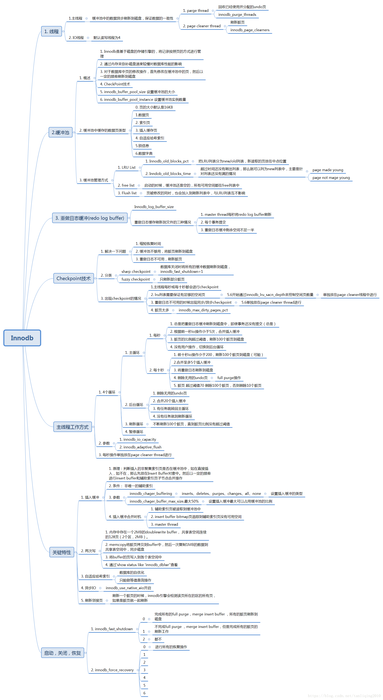
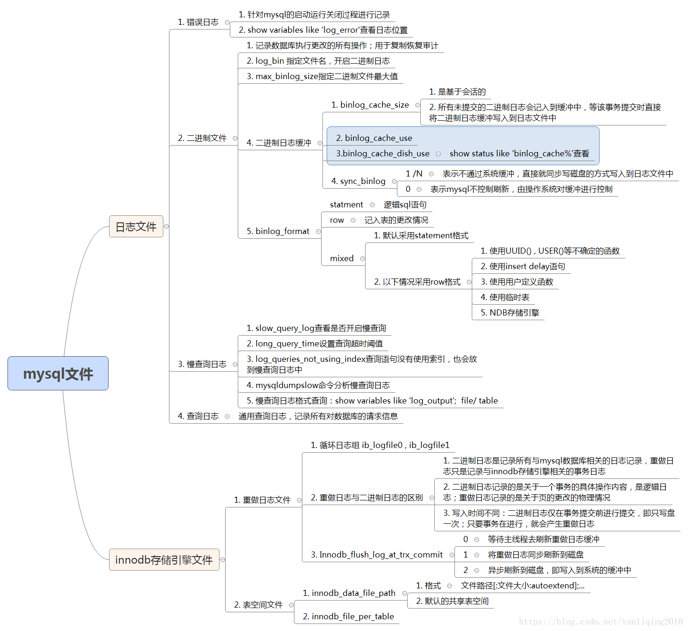
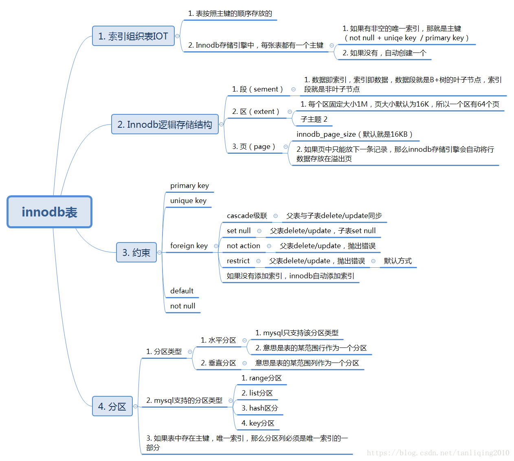
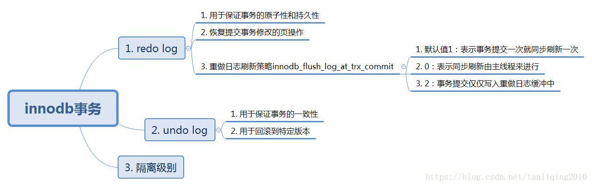
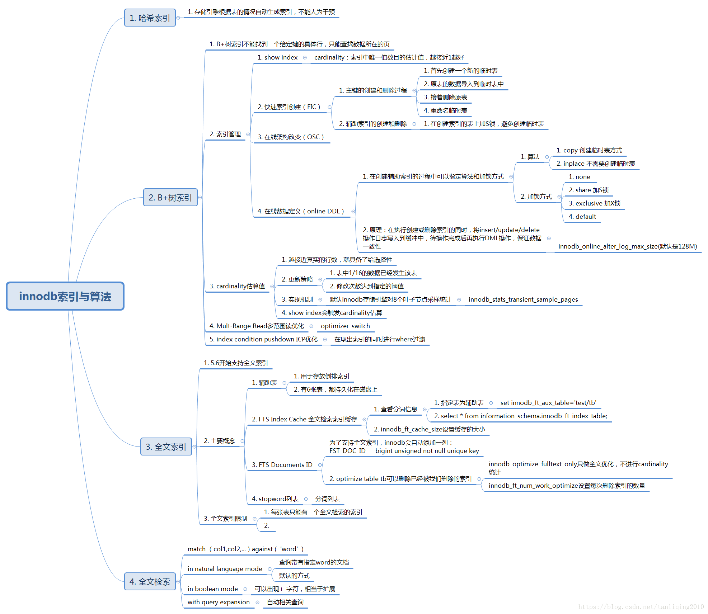
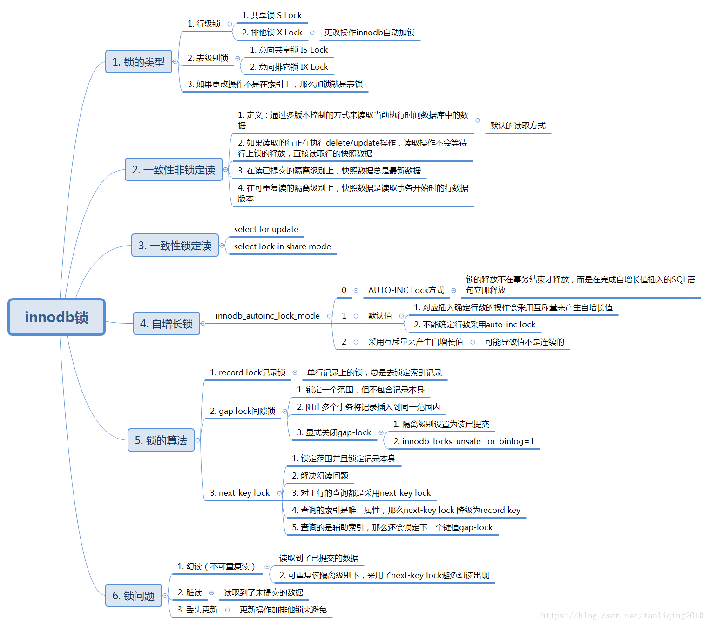

# MySQL_INNODB
`innodb相关`

## 书籍大纲
`mysql技术内幕--innodb 存储引擎`

#### **1. Innodb存储引擎**

#### **2. Innodb文件**

#### **3. Innodb表**

#### **4. Innodb事务**

#### **5. Innodb索引与算法**

#### **6. Innodb锁**
