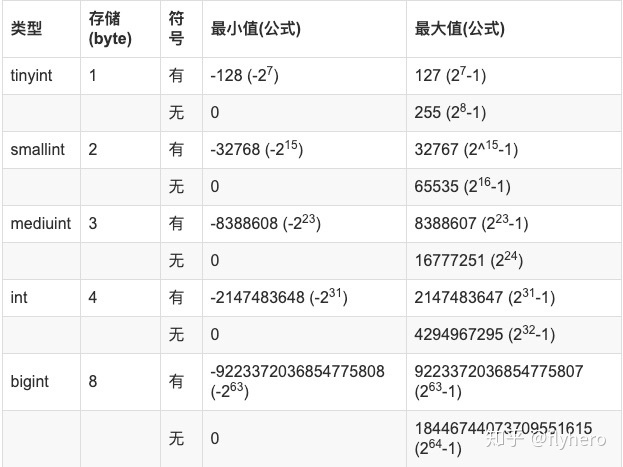

# MySQL

~~~
    你们分布式事务怎么做的？

    那么，你可以按照这样的思路回答：

    1.在项目中某场景使用到了分布式事务
    2.为什么要用分布式事务？
    3.怎么使用的分布式事务？
    4.在使用过程中遇到了什么问题，然后怎么解决的？
    5.如果看过源码，讲讲分布式事务框架的源码和实现思想
~~~

#### **1. varchar与char的区别是什么？大小限制？utf8字符集下varchar最多能存多少个字符**
- 1.主要区别：

~~~
    (1).char是一种长度固定的类型, varchar 长度可变；
    (2).char列检索出来的值，尾部空格会被删除，varchar会被保留；
~~~

- 2.存多少
    - varchar(M), 代表的是字符，无论英文或中文 都可以存储M个字符。
    - M的语法上取值范围是1~65535, 但是mysql行的最大长度是65535字节
    - 声明为char的列长度是固定的,char的长度可选范围在0-255之间.也就是char最大能存储`255个字符`.如果该列是utf8编码,则该列所占用的字节数=字符数*3.如果是gbk编码则该列所占用的字节数=字符数*2

    - 采用varchar类型存储数据需要1-2个字节(长度超过255时需要2个字节)来存储字符串的实际长度.如果该列的编码为gbk,每个字符最多占用2个字节,最大长度不能超过32766个字符.如果该列的编码为utf8,每个字符最多占3个字节,最大字符长度为21845（21844）.
    - VARCHAR是变长长度，长度范围为0-21845(utf8)或16383(utf8mb4)字符，存储时，如果字符没有达到定义的位数，也不会在后面补空格，当然还有一或两个字节来描述该字节长度

#### **2. 如果查询很慢，你会想到的第⼀个⽅式是什么？**
- 先加explain查看, type列, Extra列
- sql语句有没有什么问题, 以下为sql语句可能存在的问题:
`高性能mysql P196`
1. 方式：

    (1). 是否向数据库请求了不需要的数据
    - 查询不需要的记录
    - 多表关联时返回全部的列
    - 总是取出全部的列
    - 重复查询相同的数据

    (2). MySQL是否在扫描额外的记录
    - 最简单的衡量查询开销的的三个指标：
        - 响应时间： 服务时间(查询真正所花时间）和排队时间（等待某些资源而没有真正执行查询的时间--可能是等IO操作完成，也可能是等待行锁）, 响应时间手很多方面的影响，比如存取引擎的锁，高并发资源竞争，硬件响应等, 用 快速上限估计法来估计查询的响应时间；
            - 快速上限估计法：了解这个查询需要哪些索引以及他的执行计划是什么，然后计算大概需要多少个顺序和随机IO，再用其乘以具体硬件条件下一次IO的消耗时间，最后累加, 就可以获得一个大概的参考值；
        - 扫描的行数和访问类型：
            - explain语句中的type列反应了访问类型，访问类型有很多种, 从全表扫描到索引扫描、范围扫描、唯一索引扫描、常数引用等；这些列出来的， 速度按从慢到快, 扫描的行数也是按从大到小；
            - explain的Extra，using where时, 一般MySQL能够使用如下三种方式应用where条件， 从好到坏依次是：
                - 在索引中使用where条件来过滤不匹配的记录， 这是在存储引擎层完成的；
                - 使用索引覆盖扫描（在Extra列中出现了Using index）来返回记录。直接从索引中过滤不需要的记录并返回命中的结果，这是在MySQL服务器层中完成的， 但无需再回表查询记录
                - 从数据表中返回数据，然后过滤不满足条件的记录（在Extra列中出现Using Where）， 这是在MySQL服务器层完成， MySQL需要先从数据表读出记录然后过滤；

        - 扫描的行数和返回的行数：理想的是两者==

#### **3. 外键有什么用，是否该用外键？外键一定需要索引吗？**
`技术内幕2.13`
`数据库中为什么不推荐使用外键约束` - `https://www.cnblogs.com/rjzheng/p/9907304.html`
- 1.有什么用
~~~
    1. 利用外键关系，可以在一个表里声明‘与另一个表里的某个列相关联的‘列

    2. A foreign key is a constraint, a relationship between two tables - that has nothing to do with an index 
~~~

- 2.是否该用外键
~~~
    1.性能问题
        数据库需要维护外键的内部管理；
        外键等于把数据的一致性事务实现，全部交给数据库服务器完成；
        有了外键，当做一些涉及外键字段的增，删，更新操作之后，需要触发相关操作去检查，而不得不消耗资源；
    2.并发问题
        在使用外键的情况下，每次修改数据都需要去另外一个表检查数据,需要获取额外的锁, 若是在高并发大流量事务场景，使用外键更容易造成死锁。
    3.拓展性问题(主要是分为两点)
        a.做平台迁移方便，比如你从Mysql迁移到Oracle，像触发器、外键这种东西，都可以利用框架本身的特性来实现，而不用依赖于数据库本身的特性，做迁移更加方便。
        b.分库分表方便，在水平拆分和分库的情况下，外键是无法生效的。将数据间关系的维护，放入应用程序中，为将来的分库分表省去很多的麻烦。

    4.包括在阿里的JAVA规范中也有下面这一条【强制】不得使用外键与级联，一切外键概念必须在应用层解决。
~~~

- 3.外键要索引吗
- 虽然不会自动创建， 还是建议安装上索引， 便于查找

#### **4. 解释MySQL外连接、内连接与自连接的区别**
`技术内幕P97`
`TO BE FINISHED`
~~~
    先说什么是交叉连接: 交叉连接又叫笛卡尔积，它是指不使用任何条件，直接将一个表的所有记录和另一个表中的所有记录一一匹配。

    内连接 则是只有条件的交叉连接，根据某个条件筛选出符合条件的记录，不符合条件的记录不会出现在结果集中，即内连接只连接匹配的行。
    外连接 其结果集中不仅包含符合连接条件的行，而且还会包括左表、右表或两个表中
    的所有数据行，这三种情况依次称之为左外连接，右外连接，和全外连接。

    左外连接，也称左连接，左表为主表，左表中的所有记录都会出现在结果集中，对于那些在右表中并没有匹配的记录，仍然要显示，右边对应的那些字段值以NULL来填充。右外连接，也称右连接，右表为主表，右表中的所有记录都会出现在结果集中。左连接和右连接可以互换，MySQL目前还不支持全外连接。

    - 内连接只会显示在两个表里都匹配上的行；
    - 外连接还可以把其中一个表在另一个表里没有匹配的行也显示出来， 以NULL显示；
~~~

#### **5. SQL中Where与Having的区别**
- “Where” 是一个约束声明，使用Where来约束来之数据库的数据，Where是在结果返回之前起作用的，且Where中不能使用聚合函数。

- “Having”是一个过滤声明，是在查询返回结果集以后对查询结果进行的过滤操作，在Having中可以使用聚合函数。
~~~
　　SQL实例：

　　一、显示每个地区的总人口数和总面积：

        SELECT region, SUM(population), SUM(area)
        FROM bbc
        GROUP BY region

　　     先以region把返回记录分成多个组，这就是GROUP BY的字面含义。分完组后，然后用聚合函数对每组中的不同字段（一或多条记录）作运算。

　　二、显示每个地区的总人口数和总面积．仅显示那些人口数量超过1000000的地区。

        SELECT region, SUM(population), SUM(area)
        FROM bbc
        GROUP BY region
        HAVING SUM(population)>1000000

        [注]在这里，我们不能用where来筛选超过1000000的地区，因为表中不存在这样一条记录。相反，HAVING子句可以让我们筛选成组后的各组数据

    ps:如果想根据sum后的字段进行排序可以在后面加上：order by sum(population) desc/asc    
~~~

#### **6. mysql in，not in,like, or走不走索引**
`高性能MySQL P173`
- like看情况, 如果不是通配符开头, 最左前缀原则, 是可以的, 通配符开头则不允许;
- 查询语句中使用or关键字时，只有or前后两个条件的列都是索引时，查询时才使用索引;
- 避免使用!=或＜＞、IS NULL或IS NOT NULL、IN ，NOT IN等这样的操作符,因为这会使系统无法使用索引,而只能直接搜索表中的数据;
-  能够用BETWEEN的就不要用IN,因为IN会使系统无法使用索引,而只能直接搜索表中的数据;

#### **7. 为什么一定要设一个主键？**
- 因为你不设主键的情况下，innodb也会帮你生成一个隐藏列，作为自增主键。所以啦，反正都要生成一个主键，那你还不如自己指定一个主键，在有些情况下，就能显式的用上主键索引，提高查询效率！

#### **8. select时怎么加排它锁**
- for update
- 其他没有获取排它锁的线程, 如果要访问排它锁正在访问的对象, 会阻塞;

#### **9. 复合索引的结构**
`https://www.zhihu.com/question/36996520`
~~~
    1. mysql创建复合索引的规则是首先会对复合索引的最左边的，也就是第一个name字段的数据进行排序，在第一个字段的排序基础上，然后再对后面第二个的cid字段进行排序。其实就相当于 `实现了类似order by name cid`这样一种排序规则， 所以：第一个name字段是绝对有序的，而第二字段就是无序的了。

    2. 那么什么时候才能用到呢?当然是cid字段的索引数据也是有序的情况下才能使用咯，什么时候才是有序的呢？观察可知，当然是在name字段是等值匹配的情况下，cid才是有序的。发现没有，观察两个name名字为 c 的cid字段是不是有序的呢。从上往下分别是4  5。这也就是mysql索引规则中要求复合索引要想使用第二个索引，必须先使用第一个索引的原因。
~~~

#### **10. 如果建了⼀个包含多个列的索引，查询的时候只⽤了第⼀列，能不能⽤上这个索引？查三列呢？如果where条件后⾯带有⼀个 i + 5 < 100 会使⽤到这个索引吗？**
`高性能mysql5.3.1`
- 不能, 参考
- 很简单

#### **11. drop、truncate、delete的区别？**

#### **12. 你们数据库是否⽀持emoji表情，如果不⽀持，如何操作?**
- 数据库里面使用的是utf8编码，普通的字符串或者表情都是占位3个字节，所以utf8足够用了，但是移动端的表情符号占位是4个字节，普通的utf8就不够用了，为了应对无线互联网的机遇和挑战、避免 emoji 表情符号带来的问题、涉及无线相关的 MySQL 数据库建议都提前采用utf8mb4 字符集;

- UTF- 8：Unicode Transformation Format-8bit，允许含BOM，但通常不含BOM。是用以解决国际上字符的一种多字节编码，它对英文使用8位（即一个字节），中文使用24为（三个字节）来编码。UTF-8包含全世界所有国家需要用到的字符，是国际编码，通用性强;

- UTF8MB4：MySQL在5.5.3之后增加了utf8mb4的编码，mb4就是most bytes 4的意思，专门用来兼容四字节的unicode

#### **13. 主键是用自增还是UUID?**
- 定答自增啊。innodb 中的主键是聚簇索引。如果主键是自增的，那么每次插入新的记录，记录就会顺序添加到当前索引节点的后续位置，当一页写满，就会自动开辟一个新的页。如果不是自增主键，那么可能会在中间插入，就会引发页的分裂，产生很多表碎片！

#### **14. 主键为什么不推荐有业务含义?**
- (1)因为任何有业务含义的列都有改变的可能性,主键一旦带上了业务含义，那么主键就有可能发生变更。主键一旦发生变更，该数据在磁盘上的存储位置就会发生变更，有可能会引发页分裂，产生空间碎片。

- (2)带有业务含义的主键，不一定是顺序自增的。那么就会导致数据的插入顺序，并不能保证后面插入数据的主键一定比前面的数据大。如果出现了，后面插入数据的主键比前面的小，就有可能引发页分裂，产生空间碎片。

#### **15. primary key 和 unique key 的区别**

`技术内幕P86`

- 每个表只包含一个primary key， 可以有多个unique key；

- pk 不能包含NULL值，unique行，（NULL值不与任何值相等，甚至是另一个NULL值）

#### **16. NoSQL了解么，和关系数据库的区别**
`技术内幕2.6.2.5`
`InnoDB引擎4.9`
~~~
    非关系型数据库的优势：
    1. 性能NOSQL是基于键值对的，而且不需要经过SQL层的解析，所以性能非常高。
    2. 可扩展性同样也是因为基于键值对，数据之间没有耦合性，所以非常容易水平扩展。

    关系型数据库的优势：
    1. 复杂查询可以用SQL语句方便的在一个表以及多个表之间做非常复杂的数据查询。
    2. 事务支持使得对于安全性能很高的数据访问要求得以实现。
~~~

#### **17. 存储过程的优点**
`了解即可`
（1）.存储过程只在创造时进行编译，以后每次执行存储过程都不需再重新编译，而一般 SQL 语句每执行一次就编译一次,所以使用存储过程可提高数据库执行速度。 

（2）.当对数据库进行复杂操作时(如对多个表进行 Update,Insert,Query,Delete 时），可将此复杂操作用存储过程封装起来与数据库提供的事务处理结合一起使用。这些操作，如果用程序来完成，就变成了一条条的 SQL 语句，可能要多次连接数据库。而换成存储，只需要连接一次数据库就可以了。 

（3）.存储过程可以重复使用,可减少数据库开发人员的工作量。 

（4）.安全性高,可设定只有某此用户才具有对指定存储过程的使用权。

#### **18. 如果有很多数据插⼊MYSQL 你会选择什么⽅式?（一个数据库，每十分钟会接收到百万级的数据进行插入，应该怎么设计？）**

#### **19. 数据库三范式**

`https://www.zhihu.com/question/24696366`

#### **20. 对于最左前缀不易区分的列, 比如url的存储与查找， 如何处置?**
- 把内容倒过来插入, 然后建立索引 -- `高性能Mysql P157页也有涉及`
- 伪哈希索引 (crc(32))--`高性能Mysql P148的实例非常值的一看`

#### **21. 说说对SQL语句优化有哪些方法？**
`高性能mysql`
`TO BE FINISHED`
~~~ 
    1. sql语句的时间花在哪?
        - 等待时间, 执行时间,
    2. 执行时间, 花在哪?
        - 查找
        - 取出
    3. 如何查的快
        - 查的快, 尽量走索引
        - 取的快, 索引覆盖
        - 传输少, 更少的行和列
~~~

#### **22. explain语句**
`高性能mysql 附录A`
- 字段解释:
~~~
    1. id: 查询的序号; 
    2. select_type:
        a. SIMPLE 简单查询(不包含子查询);
        b. PRIIMARY 含子查询或者派生查询;
            (1) subquery: 非From 子查询;
            (2) derived: from子查询;
            (3) union
            (4) union result: 
    3. table:
        a. 实际的表名;
        b. 表的别名;
        c. derived: from 子查询时;
        d. null: 直接计算结果, 不走表;

    4. type: 查询的方式;
        a. all:全表扫描;
        b. index: All扫描所有的数据行, 而index扫描所有的索引节点;
        c. range: 能根据索引做范围扫描;
        d. ref: 通过索引可以直接引用到某些数据行;
        e. const, system, null: 最优， 优化到常量级别；

    5. possible keys: 可能用到的键;
        a. 可能用到的索引, 最终只会用一个;

    6. key: 真正用到的索引;

    7. key_len: 最终用到的索引的长度;

    8. ref: 两表联查, 是否有引用关系;

    9. rows: 估计本次将要查询的行数;

    10. Extra: 额外的信息;
        a. index: 索引覆盖
        b. using where: 光靠索引定位不了， 还得where 来判断下；
        c. using temporary： 产生了临时表；
        d. using filesort： 文件排序(通常再内存， 如果取出的列是text类型， filesort将发生在磁盘上）；

~~~

#### **23. Union的规则**
~~~
“Mysql技术内幕P107”
    1. 列名和数据类型：
        a. 列名以第一个select语句为准；
        b. 通常对应列数据类型应该相同，如果不同，MySQL会进行必要的类型转换；
    2. 重复行处理： 
        a. 默认情况下会自动去掉重复的行;
        b. 如果要保留重复的行, 改 union 为 union all;
    3. 如果要使用 order by 和 limit:
        a. union 需要使用order by, 需要将 select 语句括起来, order by的列字段, 以第一个select语句中的列字段为准;
        b. limit 照常使用就好;
~~~

#### **24 . 数据库优化的几个阶段**
`https://www.cnblogs.com/rjzheng/p/9619855.html`

#### **25. InnoDB 和MyISAM的数据分布对比**
- MyISAM 按照数据插入的顺序存储在磁盘上, 主键索引和其他索引没有什么不同, 主键索引就是一个名为primary的唯一非空索引;

- InnoDB聚簇索引的每一个叶子节点都包含了主键值,事务ID, 用于事务和MVCC的回滚指针,以及剩余的列;

#### **26. 延迟关联**
`高性能mysql P173`

#### **27. 查询性能优化**
- 一.  慢查询基础: 优化数据访问
>1. 是否向数据库请求了不需要的数据;
~~~
    a. 
        (1). 查询不需要的记录, select大量数据, 然后取少部分, 简单有效的办法, 查询后面加limit
        (2). 多表关联时返回全部的列;
        (3). 总是取出全部的列;
        (4). 查询重复相同的数据;
~~~

>2. mysql 是否扫描额外的记录
~~~
    一般mysql能够使用如下三种方式应用where条件, 从好到坏依次为:
    1. 在索引中使用where条件来过滤不匹配的记录,这是在存储引擎层完成的;
    2. 使用索引覆盖扫描(Extra Using index)来返回记录, 服务器层完成, 无需回表查询;
    3. 从数据表返回数据, 然后过滤,这是再服务器层完成的;
~~~

- 二. 重构查询的方式;
>1. 一个复杂查询还是多个简单查询;
>2. 切分查询--以删除为例, 一次大的删除更好的方式是分批次删;
>3. 分解关联查询;
~~~
    1. 缓存效率更高;
    2. 查询分解后, 执行单个查询可以减少锁的竞争;
    高性能P203
~~~

- 三. 查询执行的基础: 但我们向mysql发送一个请求时,mysql到底做了些什么?
~~~
    1.客户端发送一条查询给服务器;
    2.服务器先检查缓存, 如果命中了缓存, 则立刻返回结果;
    3.服务器进行SQL解析, 预处理, 再由优化器生成对应的执行计划;
    4.根据优化器生成的执行计划, 调用存储引擎的API来执行查询;
    5.将结果返回给客户端;
~~~
>1. mysql 客户端/服务器通信协议
~~~
    协议半双工：客户端与服务器之间的通信协议是半双工，要么服务器给客户端发信息， 要么客户端给服务器发，不能同时发生；
    缺点：
        一旦一端开始发送消息，另一端要接收完整个消息才能响应它；
    对于一个mysql连接(线程), 任何时刻都有一个状态, 最简单的就是 show full processlist, 状态列表: 高性能P207
~~~
>2. 查询缓存

>3. 查询优化处理 **--重点**
~~~
    1. 首先是sql的解析, 接着预处理器验证权限;
    2  优化器将语法树转化为执行计划;一条查询可能有很多种执行方式, 优化器的作用就是找到最好的那条;
    3. mysql使用基于成本的优化器;
    4. 有很多原因可能导致优化器选择错误的执行计划 -- 示例: 高性能mysql P209
    5. mysql能够处理的优化类型: --示例: 高性能mysql P211
        a.列表In()的比较:mysql中IN列表的数据会先进行排序, 然后通过二分查找的方式确定列表中的值是否满足, 这是一个O(log n)复杂度的操作, 等价的转换成OR查询的复杂度为O(n), In()列表中有大量值时, mysql的处理速度会更快;
    6.执行计划
        a. mysql生成一棵指令查询树, 存储引擎执行完成这棵树,并返回结果;
    7. 关联查询优化器:
        a. 通常优化器定义的关联顺序比人自己关联的要准确
    8. 排序优化(同城filesort)
        a. 数量小于"排序缓冲区", mysql使用内存进行"快速排序";
        b. 内存不够, 先将数据分块, 对每个块使用"快速排序",最后merge

~~~
>4. 查询执行引擎

>5. 返回结果给客户端

- 四. 查询优化器的局限性
>1. 关联子查询
>2. UNION 的限制
>3. 索引合并优化
>4. 等值传递
>5. 并行执行
>6. 哈希关联
>7. 松散索引扫描
>8. 最大值和最小值优化
>9. 在同一个表上查询和更新

- 五. 查询优化器的提示

- 六. 优化特定类型的查询 **--重点**
>1. 优化COUNT()查询;
>2. 优化关联查询;
>3. 优化子查询;
>4. 优化group by 和 distinct 查询;
>5. 优化LIMIT分页;
>6. 优化SQL_CALC_FOUND_ROWS;
>7. 优化UNION查询
>8. 静态查询分析
>9. 使用用户自定义变量

#### **48. 数据类型优化**
- 一. 选择优化的数据类型
~~~
    1. 几个简单的原则:
        a. 更小的通常更好;
        b. 简单就好;
        c. 尽量避免NULL
~~~
>1. 整形类型
~~~
    1. tinyint, smallint, mediumint,  int, bigint 分别对应:
             8,       16,        24,   32,     64   位存储空间;

    2. 可以指定宽度, 如INT(11); -- 一些mysql客户端的设置, 用来显示字符的个数;
~~~

>2. 实数类型 
~~~
    - to be finished
~~~

>3. 字符串类型 
~~~
    1. varchar:
        a. 需要额外1个(列长度255以内)或者2个字节记录字符串的长度;
    2. varchar适用场景:
        a. 字符串的最大长度比平均长度大很多;
        b. 列的更新很少;
        c. 字符集使用了utf-8等类似的复杂字符集;

    3. char:
        a. 定长;
        b. 末尾空格会被删掉;
    4. char适用场景:
        a. 短, 而且列值长度相近的字符串, 例如md5;
        b. 经常变更的;

    5. BLOB 和 TEXT:
        a. mysql 把每个BLOB和TEXT值当作一个独立的对象处理, 都是为存储很大的数据而设计的字符串数据类型;
        b. BLOB和TEXT之间仅有的不同是, BLOB存储的是二进制数据, 没有排序规则和字符集, 而TEXT有;
    
    6. 枚举：
        a．非常紧凑，通常会将列值压缩到一个或者两个字节中, 实际存储的是整数；
        b. 在.frm 文件中保存"数字 - 字符串"映射关系的"查找表", 同理排序也是按照整数来排的;
    7. 枚举缺点:
        a. 列值是固定的, 添加, 删除字符串必须使用ALTER TABLE;

~~~

>4. 日期和时间类型 
~~~
    1. datetime
        a.范围1001~9999, 精度为秒;
        b. 8字节存储;
        c. 标准格式: "1991-01-17 18:18:18"

    2. timestamp
        a. 1970.01.01以来的秒数, 范围1970~2038;
        b. 4字节存储;
        c. 显示的值依赖时区;

    3 建议:
        a. 尽量使用timestamp, 更节省空间;
        b. 存储比秒更小粒度的时间和日期: 使用bigint 存储微秒级别的时间戳或者是double 存储秒之后的小数部分;
~~~

>5. 位数据类型 
~~~
    - to be finished
~~~

>6. 选择标识符
~~~
    - to be finished
~~~

>7. 特殊类型数据
~~~
    - to be finished
~~~

- 二. MySQL schema设计中的陷阱
~~~
    1. 太多的列:
        Mysql 的存储引擎API工作时需要在"服务层"和"存储引擎层"之间通过行缓冲格式拷贝数据, 然后在服务器层将缓冲内容解码成各个列;
    2. 太多的关联
    3. 全能的枚举
    4. 变相的枚举
    5. 不必要的NULL
~~~

- 三. 范式和反范式
`参见题29`
>1. 范式的优缺点
>2. 反范式的优缺点
>3. 混用范式化和反范式化

- 四. 缓存表和汇总表
>1. 物化视图
>2. 计数器表

- 五. 加快ALTER TABLE操作的速度
>1. 只修改 .frm文件 
>2. 快速创建MyISAM 索引

#### **28. mysql表的复制**
~~~
    1.表与数据的复制->>实现表结构和数据的同步

    create table desttable select * from srctable;

            (desttable:目标表，srctable：原表）

    2.表结构的复制->>只实现表结构的同步

    create table desttable select  * from srctable where 0>1;
    或者
    create table desttable LIKE srctable;

    3.全表记录的复制->>将一个表的全部记录插入另外一个表

    insert into desttable select * from srctable;

    4.部分字段的复制

    insert into desttable(字段一，字段二.......) select (字段一，字段二.......)  from srctable;
~~~

#### **29. mysql慢查询日志**
#### **30. 表示枚举的字段为什么不用enum类型？**
~~~
    回答:在工作中表示枚举的字段，一般用tinyint类型。

    那为什么不用enum类型呢？下面两个原因

    (1)ENUM类型的ORDER BY操作效率低，需要额外操作

    (2)如果枚举值是数值，有陷阱 举个例子，表结构如下

    CREATE TABLE test (foobar ENUM('0', '1', '2'));
    此时，你执行语句

    mysql> INSERT INTO test VALUES (1);
    查询出的结果为: foobar 0

    就产生了一个坑爹的结果。 插入语句应该像下面这么写，插入的才是1

    mysql> INSERT INTO test VALUES (`1`);

~~~

#### **31. 为什么不直接存储图片、音频、视频等大容量内容?**
~~~
    我们在实际应用中，都是用HDFS来存储文件。然后mysql中，只存文件的存放路径。mysql中有两个字段类型被用来设计存放大容量文件，也就是text和blob类型。但是，我们在生产中，基本不用这两个类型！

    主要原因有如下两点
    (1)Mysql内存临时表不支持TEXT、BLOB这样的大数据类型，如果查询中包含这样的数据，在排序等操作时，就不能使用内存临时表，必须使用磁盘临时表进行。导致查询效率缓慢

    (2)binlog内容太多。因为你数据内容比较大，就会造成binlog内容比较多。大家也知道，主从同步是靠binlog进行同步，binlog太大了，就会导致主从同步效率问题！

    因此，不推荐使用text和blob类型！
~~~

#### **32. 字段为什么要定义为NOT NULL?**
`高性能mysql第二版P112`
~~~
    Mysql难以优化引用可空列查询，它会使'索引'、'索引统计'和'值比较'更加复杂。可空列需要更多的存储空间，还需要mysql内部进行特殊处理。可空列被索引后，每条记录都需要一个额外的字节，还能导致MYisam 中固定大小的索引变成可变大小的索引
~~~
#### **.**
#### **.**
#### **.**
#### **.**
#### **.**
#### **.**

#### **57. 一条SQL语句执行得很慢的原因有哪些？**
`高性能MySQL 第六章`
`https://zhuanlan.zhihu.com/p/62941196`
`to be finished`

#### **58. MySQL极限**

#### **59. MySQL慢查询开启，语句分析**
#### **60. 如何防止数据库单点问题**
#### **61. 数据库主从复制配置, 主从数据同步的原理, 主从架构的延时和数据丢失怎么解决**
#### **62. **
#### **63. 查询缓慢和解决方式（explain、慢查询日志、show profile等）**
#### **64. 数据库崩溃时事务的恢复机制（REDO日志和UNDO日志）**
#### **65. mysql 如何执行关联查询**
`高性能P214`
- 嵌套循环关联

#### **66. **

#### **74. Innodb中mysql如何快速删除2T的大表**
`https://www.cnblogs.com/rjzheng/p/9497109.html`

#### **75. int(5) 括号中的数字代表什么?**

- 数字5并不是代表存储的长度，int型的长度是4字节固定的，括号里的数字仅仅代表最小显示的宽度。

- 那我们设置它的意义何在呢？其实当我们长度超过5的时候它是没用的，和没有设置一样，当长度没有超过5时，并且设置了zerofill(填充零)，它会在不足的从左侧填充零，假如插入了数字 22 ，那么显示的是 00022 （navicat不显示，可在cmd中查看）。
- int 括号中的数字为什么默认11或10 ？
~~~
    int有符号数最小值:

    -2 1 4 7 4 8 3 6 4 8 总共11位

    2 1 4 7 4 8 3 6 4 7 总共10位

~~~

#### **76. 定点型**
- 使用方式：即DECIMAL(M,D)
~~~
    M 表示十进制数字总的个数
    D 表示小数点后面数字的位数

    M的默认取值为10，D默认取值为0。如果创建表时，某字段定义为decimal类型不带任何参数，等同于decimal(10,0)。带一个参数时，D取默认值。
    M的取值范围为1~65，取0时会被设为默认值，超出范围会报错。
    D的取值范围为0~30，而且必须<=M，超出范围会报错。

    所以，很显然，当M=65，D=0时，可以取得最大和最小值。

    举例
        例如: DECIMAL(5,2)
        范围: -999.99 到 999.99

        如果存储时，整数部分超出了范围（如上面的例子中，添加数值为1000.01），就会报错，不允许存这样的值。

        如果存储时，小数点部分若超出范围，就分以下情况：

        若四舍五入后，整数部分没有超出范围，则只警告，但能成功操作并四舍五入删除多余的小数位后保存。如999.994实际被保存为999.99。
        若四舍五入后，整数部分超出范围，则报错，并拒绝处理。如999.995和-999.995都会报错。
~~~

#### **77. 浮点数**
    浮点数是用来表示实数的一种方法，它用 M(尾数) * B( 基数)的E(指数）次方来表示实数，相对于定点数来说，在长度一定的情况下，具有表示数据范围大的特点,但同时也存在误差问题。如果希望保证值比较准确，推荐使用定点数数据类型。

~~~
    举例
    例如: float(7,4)
    范围: -999.9999 到 999.9999

    MySQL保存值时进行四舍五入，因此如果在FLOAT(7,4)列内插入999.00009，近似结果是999.0001。

    float和double中的M和D的取值默认都为0，即除了最大最小值，不限制位数。

    M、D范围:

    M取值范围为0~255。FLOAT只保证6位有效数字的准确性，所以FLOAT(M,D)中，M<=6时，数字通常是准确的。如果M和D都有明确定义，其超出范围后的处理同decimal。
    D取值范围为0~30，同时必须<=M。double只保证16位有效数字的准确性，所以DOUBLE(M,D)中，M<=16时，数字通常是准确的。如果M和D都有明确定义，其超出范围后的处理同decimal。
    FLOAT和DOUBLE中，若M的定义分别超出7和17，则多出的有效数字部分，取值是不定的，通常数值上会发生错误。因为浮点数是不准确的，所以我们要避免使用“=”来判断两个数是否相等。

~~~

#### **78. 时间类型**
- 日期类型的选择
    如果你的应用不牵涉到时区/国际业务，那么你最好选择datetime/timestamp，可读性高，统计方便。
    如果你的应用牵涉的时区或国际业务，你们建议你使用bigint/timestamp来存储时间戳。
~~~
    (1)timestamp，该类型是四个字节的整数，它能表示的时间范围为1970-01-01 08:00:01到2038-01-19 11:14:07。2038年以后的时间，是无法用timestamp类型存储的。 但是它有一个优势，timestamp类型是带有时区信息的。一旦你系统中的时区发生改变，例如你修改了时区
    SET TIME_ZONE = "america/new_york";
    你会发现，项目中的该字段的值自己会发生变更。这个特性用来做一些国际化大项目，跨时区的应用时，特别注意！

    (2)datetime，datetime储存占用8个字节，它存储的时间范围为1000-01-01 00:00:00 ~ 9999-12-31 23:59:59。显然，存储时间范围更大。但是它坑的地方在于，他存储的是时间绝对值，不带有时区信息。如果你改变数据库的时区，该项的值不会自己发生变更！

    (3)bigint，也是8个字节，自己维护一个时间戳，表示范围比timestamp大多了，就是要自己维护，不大方便。
~~~
- 

- 如果你认为你的应用能够运行到2037年以后，那么别用timestamp。

#### **81. MySQL数据库中MyISAM和InnoDB的区别**
- MyISAM：
~~~
    1.不支持事务，但是每次查询都是原子的；

    2.支持表级锁，即每次操作是对整个表加锁；

    3.存储表的总行数；

        一个MYISAM表有三个文件：索引文件、表结构文件、数据文件；

        采用菲聚集索引，索引文件的数据域存储指向数据文件的指针。辅索引与主索引基本一致，但是辅索引不用保证唯一性。
~~~

- InnoDb：

~~~
    支持ACID的事务，支持事务的四种隔离级别；

    支持行级锁及外键约束：因此可以支持写并发；

    不存储总行数；

    一个InnoDb引擎存储在一个文件空间（共享表空间，表大小不受操作系统控制，一个表可能分布在多个文件里），也有可能为多个（设置为独立表空，表大小受操作系统文件大小限制，一般为2G），受操作系统文件大小的限制；

    主键索引采用聚集索引（索引的数据域存储数据文件本身），辅索引的数据域存储主键的值；因此从辅索引查找数据，需要先通过辅索引找到主键值，再访问辅索引；最好使用自增主键，防止插入数据时，为维持B+树结构，文件的大调整。

    总结 -- 五点区别:
        1>.InnoDB支持事务，而MyISAM不支持事务
        2>.InnoDB支持行级锁，而MyISAM支持表级锁
        3>.InnoDB支持MVCC, 而MyISAM不支持
        4>.InnoDB支持外键，而MyISAM不支持
        5>.InnoDB不支持全文索引，而MyISAM支持。
~~~

#### **82. mysql里记录货币用什么字段类型好**
~~~

    如果货币单位是分，可以用Int类型。如果坚持用元，用Decimal。

    千万不要答float和double，因为float和double是以二进制存储的，所以有一定的误差。 打个比方，你建一个列如下
    CREATE TABLE `t` (
    `price` float(10,2) DEFAULT NULL,
    ) ENGINE=InnoDB DEFAULT CHARSET=utf8
    然后insert给price列一个数据为1234567.23，你会发现显示出来的数据变为1234567.25，精度失准！

    NUMERIC和DECIMAL类型被Mysql实现为同样的类型，这在SQL92标准允许。他们被用于保存值，该值的准确精度是极其重要的值，例如与金钱有关的数据。当声明一个类是这些类型之一时，精度和规模的能被(并且通常是)指定。

    例如：

    salary DECIMAL(9,2)

    在这个例子中，9(precision)代表将被用于存储值的总的小数位数，而2(scale)代表将被用于存储小数点后的位数。

    因此，在这种情况下，能被存储在salary列中的值的范围是从-9999999.99到9999999.99。

~~~

#### **83. MySQL数据库作发布系统的存储，一天五万条以上的增量，预计运维三年,怎么优化？**
~~~
    a. 设计良好的数据库结构，允许部分数据冗余，尽量避免join查询，提高效率。
    b. 选择合适的表字段数据类型和存储引擎，适当的添加索引。
    c. mysql库主从读写分离。
    d. 找规律分表，减少单表中的数据量提高查询速度。
    e. 添加缓存机制，比如memcached，apc等。
    f. 书写高效率的SQL。比如 SELECT * FROM TABEL 改为 SELECT field_1, field_2, field_3 FROM TABLE.
~~~

#### **85. 对于千万级别的大表, 应该如何优化**
`TO BE FINISHED`
`https://www.zhihu.com/question/19719997/answer/81930332`

#### **87. SQL语言包括哪几部分？每部分都有哪些操作关键字？**
`TO BE FINISHED`
SQL语言包括数据定义(DDL)、数据操纵(DML),数据控制(DCL)和数据查询（DQL）四个部分。

数据定义：Create Table,Alter Table,Drop Table, Craete/Drop Index等

数据操纵：Select ,insert,update,delete,

数据控制：grant,revoke

数据查询：select

#### **88. 自增主键用完了该怎么办**
- 简单版
~~~
    我们以无符号整型为例，存储范围为0～4294967295，约43亿！我们先说一下，一旦自增id达到最大值，此时数据继续插入是会报一个主键冲突异常,那解决方法也是很简单的，将Int类型改为BigInt类型，BigInt的范围如下
~~~

- 高深版
~~~
    假设啊，你的表里的自增字段为有符号的Int类型的，也就是说，你的字段范围为-2147483648到2147483648。 一切又那么刚好，你的自增ID是从0开始的，也就是说，现在你的可以用的范围为0～2147483648。 我们明确一点，表中真实的数据ID，肯定会出现一些意外，ID不一定是连续的。

    因此，表中的真实id必然会出现断续的情况。 好，那这会你的自增主键id的数据范围为0～2147483648，也就是单表21亿条数据！考虑id会出现断续，真实数据顶多18亿条吧。 老哥，都单表18亿条了，还不分库分表？你一旦分库分表了，就不能依赖于每个表的自增ID来全局唯一标识这些数据了。此时，我们就需要提供一 个全局唯一的ID号生成策略来支持分库分表的环境。

    面试官:"那自增主键达到最大值了，用完了怎么办？" 
    你:"这问题没遇到过，因为自增主键一般用int类型，一般达不到最大值，我们就分库分表了，所以不曾遇见过！"
~~~

#### **90. innodb的优势**

#### **91. MySQL 三种关联查询的方式: ON vs USING vs 传统风格**
~~~
    看看下面三个关联查询的 SQL 语句有何区别？

        SELECT * FROM film JOIN film_actor ON (film.film_id = film_actor.film_id)
        SELECT * FROM film JOIN film_actor USING (film_id)
        SELECT * FROM film, film_actor WHERE film.film_id = film_actor.film_id
        
    最大的不同更多是语法糖，但有一些有意思的东西值得关注。

    为了方便区别，我们将前两种写法称作是 ANSI 风格，第三种称为 Theta 风格。

    1.Theta 风格
        在 FROM 短语中列出了关联的表名，而 WHERE 短语则指定如何关联。

        这种写法被认为是古老的方式，有些时候比较难以理解，请看下面查询：

        SELECT * FROM film, film_actor WHERE film.film_id = film_actor.film_id AND actor_id = 17 AND film.length > 120
        上述查询列出片长超过 120 分钟的电影，其中包括演员编号是 17 的条件。别在意查询结果，查询本身如何呢？WHERE 表达式中包含三个条件，要看出哪个条件是关联，哪个条件是过滤还是稍费点事的。不过还是相对简单的，但如果是 5 个表，20 多个条件呢？

    2. ANSI 风格: ON
        使用 JOIN ... ON 可以将表关联的条件和记录过滤条件分开，将上面的语句重写后的结果如下：

        SELECT * FROM film JOIN film_actor ON (film.film_id = film_actor.film_id) WHERE actor_id = 17 AND film.length > 120
        看起来清晰许多。

    
    3.ANSI 风格: USING
        有一种特殊情况，当两个要关联表的字段名是一样的，我们可以使用  USING ，可减少 SQL 语句的长度:

        SELECT * FROM film JOIN film_actor USING (film_id) WHERE actor_id = 17 AND film.length > 120
        这个时候括号就是必须的了。这种写法很好，输入更少的单词，查询的性能也非常棒，但还需要注意一些差异。

    就是说这三种方式除了写法不同外，没什么区别
~~~

#### **92. 一致性哈希**
`程序员代码面试指南`--P313

#### **94. 讲讲es**
`https://zhuanlan.zhihu.com/p/62892586`

#### **96. mysql中limit offset**
~~~
    ① selete * from testtable limit 2,1;

    ② selete * from testtable limit 2 offset 1;

    注意：

    1.数据库数据计算是从0开始的

    2.offset X是跳过X个数据，limit Y是选取Y个数据

    3.limit  X,Y  中X表示跳过X个数据，读取Y个数据

    这两个都是能完成需要，但是他们之间是有区别的：

    ①是从数据库中第三条开始查询，取一条数据，即第三条数据读取，一二条跳过

    ②是从数据库中的第二条数据开始查询两条数据，即第二条和第三条
~~~

#### **.**
#### **.**
#### **.**
#### **.**
#### **.**
#### **.**
#### **.**
#### **.**
#### **.**
#### **.**
#### **.**
#### **.**
#### **.**
#### **.**
#### **.**